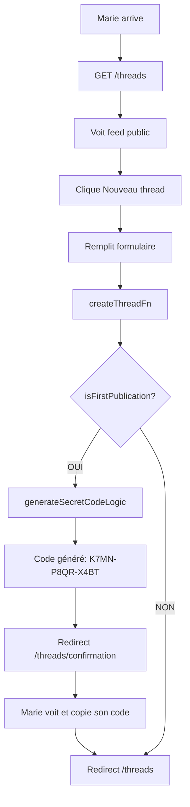
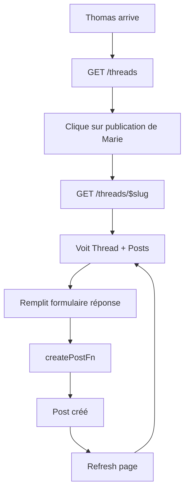
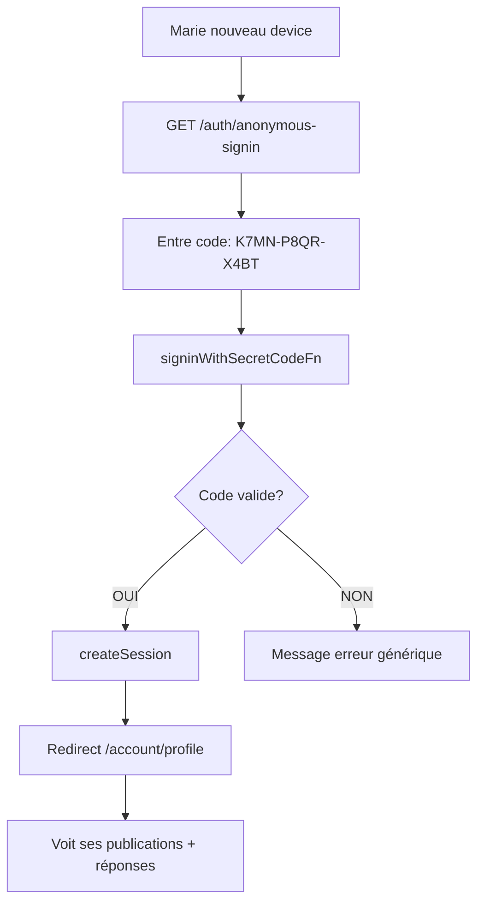

# Architecture : Flux Threads & Posts

**Date**: 2025-01-27  
**Version**: 2.0 (Refactoring post-anonymat)

---

## 📋 Résumé des changements

### Ancien flux (v1.0)
```
/threads → Liste des threads
/posts   → Liste des posts (REDONDANT)
```

### Nouveau flux (v2.0)
```
/threads              → Feed public de TOUTES les publications
/threads/$slug        → Détail d'une publication + réponses
/account/profile      → Mes publications + Mes réponses
/posts                → ❌ SUPPRIMÉ
```

---

## 🎯 Terminologie & Modèle de données

### Selon le PRD

| Terme PRD | Modèle DB | Description |
|-----------|-----------|-------------|
| **Publication** | `threads` | Sujet principal créé par un utilisateur (FR7) |
| **Réponse** | `posts` | Réponse à une publication existante (FR12) |
| **Commentaire** | `comments` | Commentaire sur une réponse (optionnel MVP) |

### Relations

```
User
  └─> Alias (1 utilisateur peut avoir plusieurs alias)
       ├─> Thread (publications)
       └─> Post (réponses)
            └─> Comment (commentaires)
```

---

## 🔄 Flux utilisateur complet

### Parcours 1 : Marie (Anonyme) - Première publication



**Code secret généré UNIQUEMENT sur premier Thread**
- ✅ Détection : `existingThreads.length === 0`
- ✅ Condition : `currentUser.isAnonymous === true`
- ✅ Retour : `{ success: true, thread, secretCode, isFirstPublication: true }`

### Parcours 2 : Thomas - Réponse à une publication



**Pas de code secret sur réponse (Post)**
- ✅ Code généré UNIQUEMENT sur Thread
- ❌ Pas de code sur Post

### Parcours 3 : Marie revient (autre appareil)



---

## 📁 Structure des routes

### Routes principales

```
/                           → Page d'accueil
/threads                    → Feed public (FR14)
  ├─ GET /threads           → Liste TOUTES les publications
  └─ GET /threads/$slug     → Détail + réponses (FR18)

/account/profile            → Profil utilisateur
  ├─ Onglet "Mes publications" (Threads)
  └─ Onglet "Mes réponses" (Posts)

/auth/anonymous-signin      → Reconnexion code secret (FR3)
/threads/confirmation       → Affichage code secret
```

### Routes supprimées

```
❌ /posts                   → SUPPRIMÉ (redondant)
```

---

## 🔧 Server Functions

### Threads

| Function | Path | Description |
|----------|------|-------------|
| `getThreadsFn` | `get-threads.ts` | Liste TOUS les threads (feed public) |
| `getThreadBySlugFn` | `get-thread-by-slug.ts` | Détail d'un thread |
| `getUserThreadsFn` | `get-user-threads.ts` | Threads de l'utilisateur connecté |
| `createThreadFn` | `create-thread.ts` | Créer thread + génération code secret |

### Posts (Réponses)

| Function | Path | Description |
|----------|------|-------------|
| `getPostsByThreadFn` | `get-posts-by-thread.ts` | Posts d'un thread spécifique |
| `getUserPostsFn` | `get-user-posts.ts` | Posts de l'utilisateur connecté |
| `createPostFn` | `create-post.ts` | Créer une réponse |

### Authentification

| Function | Path | Description |
|----------|------|-------------|
| `generateSecretCodeFn` | `generate-secret-code-fn.ts` | Générer code secret |
| `signinWithSecretCodeFn` | `signin-with-secret-code.ts` | Reconnexion avec code |

---

## 🎨 Composants UI

### ThreadCard
- Utilisé dans : `/threads`, `/account/profile`
- Affiche : Titre, catégorie, auteur, date, extrait

### PostCard
- Utilisé dans : `/threads/$slug`, `/account/profile`
- Affiche : Contenu, auteur, date, thread parent (si profile)
- Gestion : Contenu sensible, floutage, révélation

### SecretCodeDisplay
- Utilisé dans : `/threads/confirmation`
- Affiche : Code secret avec instructions
- Fonctionnalités : Copier, avertissements, UX empathique

---

## 🔒 Sécurité & Anonymat

### Code secret

**Génération**
- ✅ Format : `XXXX-XXXX-XXXX` (12 caractères)
- ✅ Crypto : `randomBytes()` avec `30^12` combinaisons
- ✅ Unicité : Contrainte DB + retry logic
- ✅ Idempotence : Retourne code existant si déjà généré
- ✅ Pas de log : Seulement métadonnées (`codeLength`)

**Utilisation**
- ✅ Reconnexion multi-appareils
- ✅ Retrouver publications/réponses
- ✅ Message erreur générique si invalide (anti-énumération)

### Anonymat (NFR3)

- ✅ `user.isAnonymous === true`
- ✅ `user.email === null`
- ✅ Code secret lié à `userId` (pas d'info personnelle)
- ✅ Alias pour masquer identité réelle

---

## ✅ Acceptance Criteria couverts

### FR7 : Créer publication
- ✅ Formulaire dans `/threads`
- ✅ Catégorie, titre, body
- ✅ Envoi pour modération

### FR12 : Réponse à publication
- ✅ Formulaire dans `/threads/$slug`
- ✅ Lié au thread parent
- ✅ Contenu sensible optionnel

### FR14 : Liste publications
- ✅ `/threads` affiche TOUTES les publications
- ✅ Feed public accessible sans compte

### FR18 : Lecture publication + réponses
- ✅ `/threads/$slug` affiche thread + posts
- ✅ Ordre chronologique

### Story 1.2 : Code secret après première publication
- ✅ Détection `isFirstPublication`
- ✅ Génération automatique
- ✅ Affichage dans `/threads/confirmation`

### Story 1.3 : Récupération via code secret
- ✅ Page `/auth/anonymous-signin`
- ✅ Reconnexion session Better-Auth
- ✅ Accès aux publications dans `/account/profile`

---

## 🧪 Tests

### Unit Tests
- ✅ `generate-secret-code.test.ts` : Format, unicité, exclusion caractères
- ✅ `user-schema.test.ts` : Colonnes secretCode, timestamps

### Integration Tests
- ✅ `create-thread-secret-code.test.ts` : Première publication + code
- ✅ `secret-code-security.test.ts` : Pas de logs, anti-énumération

### E2E Tests
- ✅ `anonymous-signin.e2e.test.ts` : Reconnexion complète avec code

---

## 📊 Métriques de succès

### Performance (NFR5, NFR6)
- [ ] Chargement `/threads` < 2 secondes
- [ ] Création thread + code < 3 secondes

### Accessibilité (NFR7, NFR8)
- [ ] WCAG 2.1 AA
- [ ] Navigation clavier complète
- [ ] Lecteurs d'écran testés

### Sécurité (NFR3)
- [x] Pas de logs du code secret
- [x] Messages erreur génériques
- [x] Rate limiting (Arcjet)
- [x] Anonymat préservé

---

## 🚀 Prochaines étapes

### MVP
1. ✅ Refactoring architecture (terminé)
2. ✅ Code secret fonctionnel (terminé)
3. ✅ Page profile avec publications (terminé)
4. [ ] Tests E2E complets (à finaliser)
5. [ ] Modération (Epic 5)

### Post-MVP
- [ ] Dashboard modérateur
- [ ] Recherche et filtres avancés
- [ ] Notifications
- [ ] Système de badges/réputation

---

## 📝 Notes techniques

### Pourquoi supprimer `/posts` ?

**Problème** : Deux feeds publics séparés créaient confusion
- `/threads` = liste des threads
- `/posts` = liste des posts (redondant)

**Solution** : Un seul feed public unifié
- `/threads` = feed principal (publications)
- `/threads/$slug` = détail avec réponses intégrées
- `/account/profile` = vue personnelle (mes publications + réponses)

### Migration données

Aucune migration nécessaire :
- ✅ Modèles DB inchangés (`threads`, `posts`)
- ✅ Seules les routes changent
- ✅ Server functions ajoutées (pas de breaking changes)

### Compatibilité

- ✅ Code secret existant : fonctionnel
- ✅ Threads existants : affichés dans nouveau flux
- ✅ Posts existants : affichés dans `/threads/$slug`

---

**Dernière mise à jour** : 2025-01-27  
**Auteur** : John (Product Manager) + Dev-linux  
**Status** : ✅ Refactoring terminé
