# Authentication Flows

This document describes the authentication flows implemented in the application, with a focus on anonymous user support and secret code recovery.

## Table of Contents

1. [Vue d'Ensemble - Architecture Complète](#vue-densemble---architecture-complète)
2. [Anonymous Session Flow](#anonymous-session-flow)
3. [Secret Code Generation](#secret-code-generation)
4. [Secret Code Recovery](#secret-code-recovery)
5. [Email/Username Registration (Story 1.4)](#emailusername-registration-story-14)
6. [Email/Username Sign In (Story 1.5)](#emailusername-sign-in-story-15)
7. [Account Linking (Anonymous → Registered)](#account-linking-anonymous--registered)
8. [Multi-Device Support](#multi-device-support)
9. [Security Considerations](#security-considerations)

---

## Vue d'Ensemble - Architecture Complète

### Diagramme Global des Flux d'Authentification

```mermaid
flowchart TB
    Start([Utilisateur Arrive sur le Site])

    Start --> Choice{Type d'Accès}

    %% Flux Anonyme
    Choice -->|Anonyme| AnonBtn[Clic "Publier Anonymement"]
    AnonBtn --> CreateAnonSession[Better-Auth: Créer Session Anonyme]
    CreateAnonSession --> AnonUser[(User: isAnonymous=true)]
    AnonUser --> CreateAlias[Créer Alias Principal]
    CreateAlias --> FirstThread[Créer Premier Thread]
    FirstThread --> GenCode{Première Publication?}
    GenCode -->|Oui| SecretCodeGen[Générer Code Secret]
    SecretCodeGen --> DisplayCode[Afficher Code à l'Utilisateur]
    DisplayCode --> ConfirmPage[Page /threads/confirmation]
    GenCode -->|Non| ThreadList[Redirection /threads]

    %% Flux Récupération Code
    Choice -->|Récupérer Compte| RecoveryPage[Page /auth/anonymous-signin]
    RecoveryPage --> EnterCode[Saisir Code Secret]
    EnterCode --> ValidateCode{Code Valide?}
    ValidateCode -->|Oui| CreateSession[Better-Auth: Créer Session]
    CreateSession --> LoadUser[Charger User + Alias]
    LoadUser --> Dashboard[Redirection /threads]
    ValidateCode -->|Non| ErrorMsg[Message Erreur Générique]
    ErrorMsg --> RecoveryPage

    %% Flux Inscription Email
    Choice -->|Créer Compte| SignupPage[Page /auth/signup]
    SignupPage --> FillForm[Remplir Formulaire]
    FillForm --> ValidateForm{Validation Zod?}
    ValidateForm -->|Erreur| ShowErrors[Afficher Erreurs]
    ShowErrors --> FillForm
    ValidateForm -->|OK| CallSignup[signupWithEmailFn]
    CallSignup --> CheckDuplicate{Email/Username Unique?}
    CheckDuplicate -->|Non| DupError[Erreur Duplicate]
    DupError --> FillForm
    CheckDuplicate -->|Oui| BetterAuthSignup[Better-Auth: signUp.email]
    BetterAuthSignup --> CreateRegisteredUser[(User: isAnonymous=false)]
    CreateRegisteredUser --> CreateAliasReg[Créer Alias Principal]
    CreateAliasReg --> CheckAnon{Session Anonyme Existante?}
    CheckAnon -->|Oui| LinkModal[Modal: Lier Publications?]
    LinkModal --> LinkChoice{Accepter Liaison?}
    LinkChoice -->|Oui| MigratePosts[linkAnonymousAccountFn]
    MigratePosts --> UpdateThreads[UPDATE threads SET aliasId]
    UpdateThreads --> VerifyPage[Page /auth/verify-email]
    LinkChoice -->|Non| VerifyPage
    CheckAnon -->|Non| VerifyPage

    %% Flux Connexion
    Choice -->|Se Connecter| SigninPage[Page /auth/signin]
    SigninPage --> EnterCreds[Entrer Email + Password]
    EnterCreds --> CallSignin[signinWithEmailFn]
    CallSignin --> BetterAuthSignin[Better-Auth: signIn.email]
    BetterAuthSignin --> CheckVerified{Email Vérifié?}
    CheckVerified -->|Non| VerifyRequired[Page /auth/verify-email-required]
    VerifyRequired --> ResendEmail[Bouton Renvoyer Email]
    ResendEmail --> VerifyPage
    CheckVerified -->|Oui| CheckCreds{Credentials Valides?}
    CheckCreds -->|Non| InvalidCreds[Erreur: Identifiants Invalides]
    InvalidCreds --> SigninPage
    CheckCreds -->|Oui| CreateSessionLogin[Créer Session JWT]
    CreateSessionLogin --> LoadUserLogin[Charger User + Alias]
    LoadUserLogin --> CallbackURL{CallbackURL Fourni?}
    CallbackURL -->|Oui| RedirectCallback[Redirection vers CallbackURL]
    CallbackURL -->|Non| RedirectDashboard[Redirection /threads]

    %% Flux Déconnexion
    Dashboard --> UserMenu{Menu Utilisateur}
    UserMenu -->|Déconnexion| SignoutBtn[Clic Déconnexion]
    SignoutBtn --> CallSignout[signoutFn]
    CallSignout --> BetterAuthSignout[Better-Auth: signOut]
    BetterAuthSignout --> InvalidateSession[Invalider Session Serveur]
    InvalidateSession --> ClearCookies[Supprimer Cookies JWT]
    ClearCookies --> RedirectHome[Redirection /]

    style AnonUser fill:#e1f5ff
    style CreateRegisteredUser fill:#ffe1e1
    style SecretCodeGen fill:#fff4e1
    style DisplayCode fill:#fff4e1
    style MigratePosts fill:#e8f5e1
    style CreateSession fill:#f0e1ff
    style CreateSessionLogin fill:#f0e1ff
```

### Légende des États Utilisateur

| État                       | Description                            | Stockage DB                                                    |
| -------------------------- | -------------------------------------- | -------------------------------------------------------------- |
| **Anonyme**                | Session temporaire, pas d'email        | `isAnonymous: true, email: null, secretCode: "XXXX-XXXX-XXXX"` |
| **Enregistré Non-Vérifié** | Compte créé, email non confirmé        | `isAnonymous: false, email: "user@...", emailVerified: false`  |
| **Enregistré Vérifié**     | Compte complet et fonctionnel          | `isAnonymous: false, email: "user@...", emailVerified: true`   |
| **Anonyme Migré**          | Ancien anonyme lié à compte enregistré | `isAnonymous: false, email: "user@...", secretCode: preserved` |

---

## Anonymous Session Flow

Anonymous users can start participating immediately without providing any personal information.

### Diagramme de Séquence - Session Anonyme

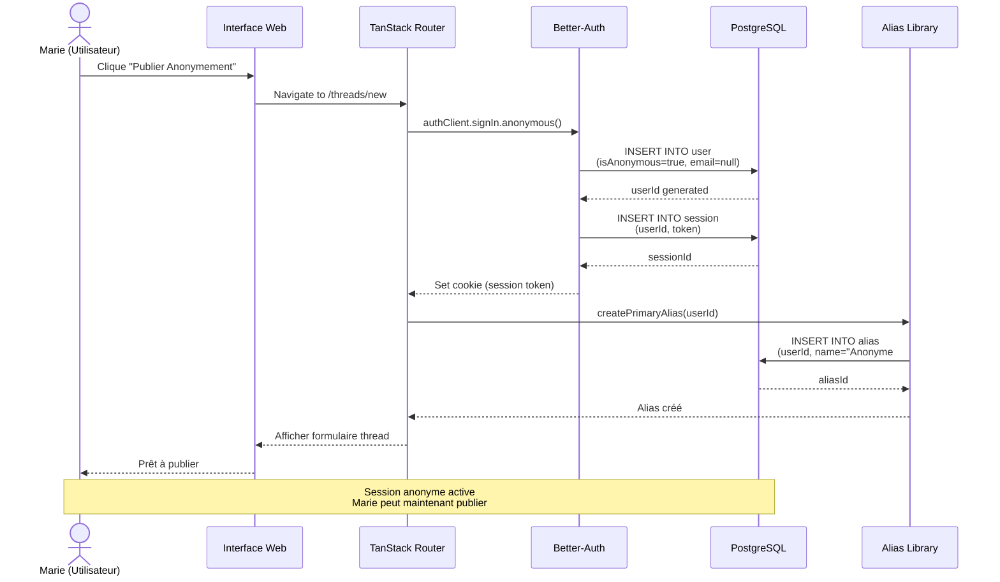

### Flow Steps

1. **User Action**: User navigates to `/threads/new` to create a post
2. **Anonymous Session Creation**:
   - Better-Auth creates an anonymous session automatically
   - User record created with `isAnonymous: true` and `email: null`
   - Primary alias generated automatically (e.g., "Anonyme #1234")
3. **First Publication**: User creates their first thread/post
4. **Secret Code Generation** (automatic after first publication):
   - System detects first publication by anonymous user
   - Generates unique secret code (format: `XXXX-XXXX` or `XXXX-XXXX-XXXX`)
   - Stores code in `user.secretCode` field with `secretCodeGeneratedAt` timestamp
   - Displays code to user with clear instructions to save it

### Implementation Files

- **Server Function**: `src/features/auth/server/create-anonymous-session.ts`
- **Secret Code Generation**: `src/features/auth/lib/generate-secret-code.ts`
- **Secret Code Display**: `src/features/auth/components/SecretCodeDisplay.tsx`
- **Thread Creation Hook**: Integration in thread creation server function

---

## Secret Code Generation

Secret codes enable anonymous users to reconnect to their account from any device.

### Diagramme de Séquence - Génération Code Secret

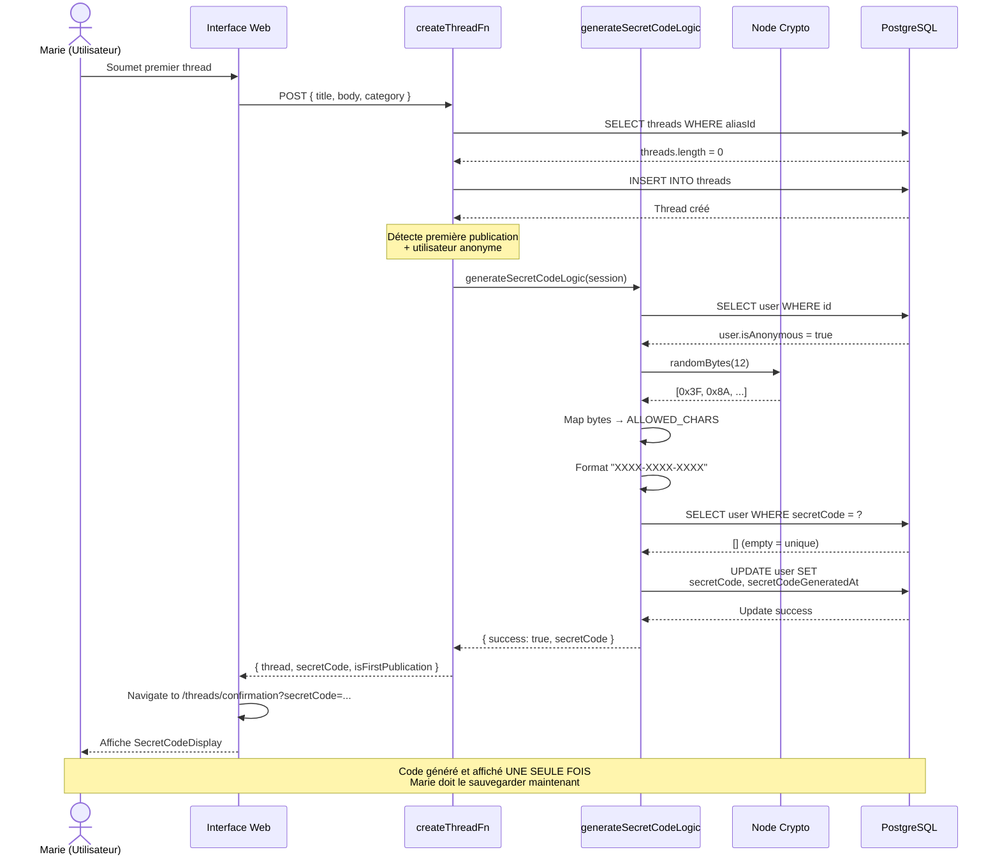

### Code Format

- **8-character code**: `XXXX-XXXX` (e.g., `K7MN-P8QR`)
- **12-character code**: `XXXX-XXXX-XXXX` (e.g., `X4BT-9C2W-H5JK`)
- **Character set**: `A-Z` and `2-9` (excludes ambiguous characters: `0`, `O`, `I`, `1`, `l`)
- **Separator**: Dash (`-`) every 4 characters for readability

### Generation Process

1. Generate random code using cryptographically secure method
2. Check uniqueness against database (`user.secretCode` has unique index)
3. Retry if collision detected (extremely rare with 30^8 to 30^12 space)
4. Store code in database with generation timestamp
5. Display to user ONE TIME with prominent warning to save it

### Diagramme de Décision - Génération Code

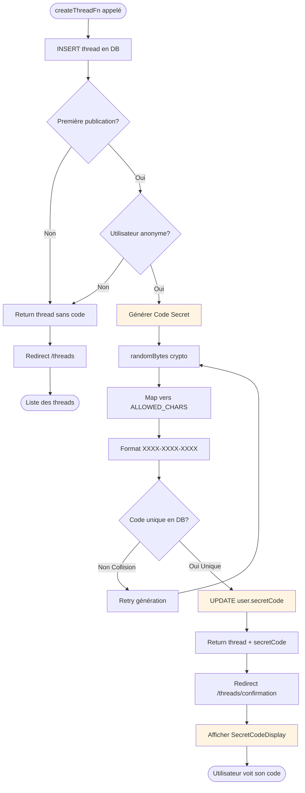

### Security

- **Code space**: 30^8 = 656 billion for 8-char, 30^12 = 5.3 quintillion for 12-char
- **Timing attack protection**: Database queries use constant-time comparison
- **No logging**: Secret codes are never logged in plain text
- **Rate limiting**: Arcjet rate limiting prevents brute force attacks
- **One-time display**: Code shown once, user must save it themselves

### Implementation Files

- **Generation Logic**: `src/features/auth/lib/generate-secret-code.ts`
- **Server Function**: `src/features/auth/server/generate-secret-code-fn.ts`
- **Database Schema**: `src/db/schemas/user.ts` (fields: `secretCode`, `secretCodeGeneratedAt`)
- **Migration**: Database migration adds unique index on `secretCode`

---

## Secret Code Recovery

Users can sign in with their secret code from any device to access their anonymous account.

### Diagramme de Séquence - Récupération via Code Secret

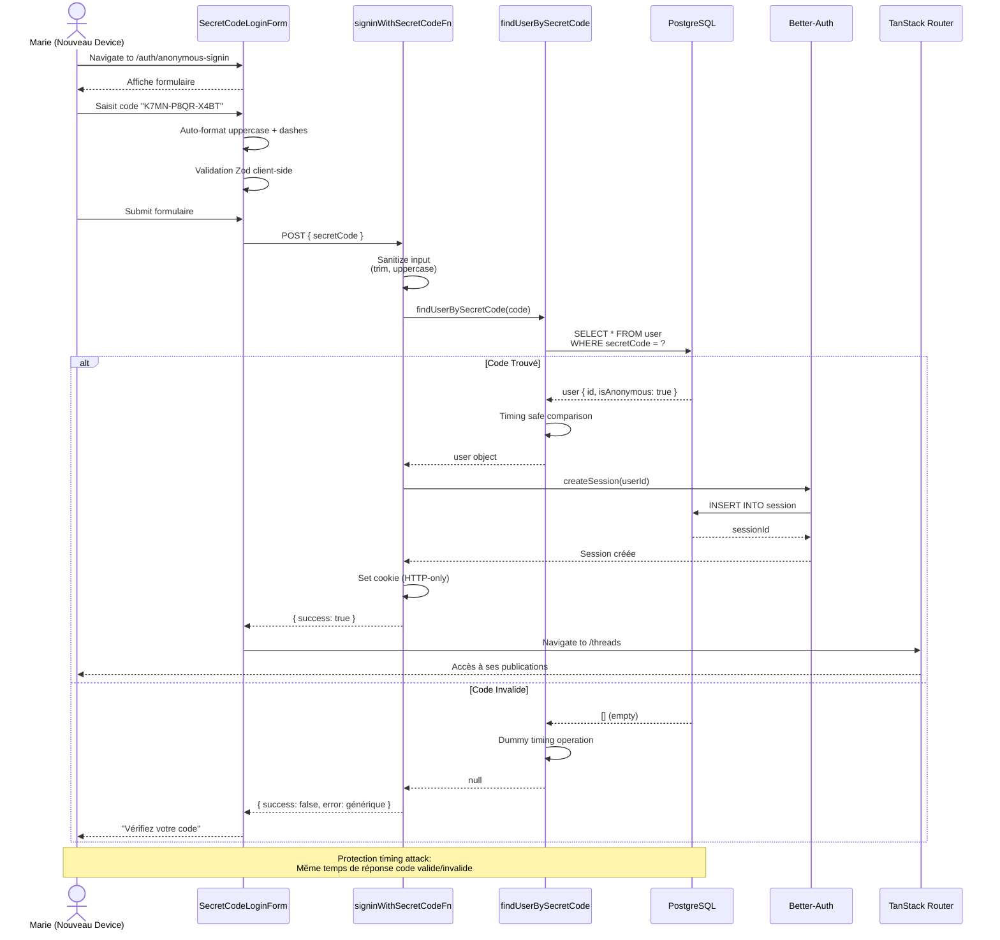

### Flow Steps

1. **User Action**: User navigates to `/auth/anonymous-signin`
2. **Code Input**:
   - User enters secret code manually OR pastes from clipboard
   - Auto-formatting: converts to uppercase, adds dashes automatically
   - Client-side validation: checks format before submission
3. **Server Validation**:
   - Sanitize input (trim, uppercase)
   - Query database for user with matching `secretCode`
   - Timing attack protection: constant-time comparison even for invalid codes
   - Verify user is anonymous (`email === null`)
4. **Session Creation**:
   - Better-Auth creates new database session
   - Session linked to found `userId`
   - Session token stored in HTTP-only cookie
5. **Success**: User redirected to `/posts` with full access to their content

### Error Handling

All error messages are **empathetic and generic** to prevent information leakage:

- ✅ "Impossible de se connecter. Vérifiez votre code."
- ❌ NOT: "Code invalide" or "Code introuvable"

This prevents attackers from determining if a code exists in the database.

### UI/UX Features

- **Auto-formatting**: Uppercase conversion and dash insertion as user types
- **Paste button**: One-click paste from clipboard (mobile-friendly)
- **Help text**: Clear instructions on where to find the code
- **Format hint**: `XXXX-XXXX` or `XXXX-XXXX-XXXX` displayed as placeholder
- **Contextual help**: Alert explaining the purpose of secret codes
- **Alternative actions**: Links to create new anonymous session or sign in with email

### Implementation Files

- **Route**: `src/routes/auth/anonymous-signin.tsx`
- **Form Component**: `src/features/auth/components/SecretCodeLoginForm.tsx`
- **Server Function**: `src/features/auth/server/signin-with-secret-code.ts`
- **Database Query**: `src/features/auth/lib/find-user-by-code.ts`

---

## Email/Username Registration (Story 1.4)

Traditional registration for users who want a permanent account.

### Diagramme de Séquence - Inscription Email

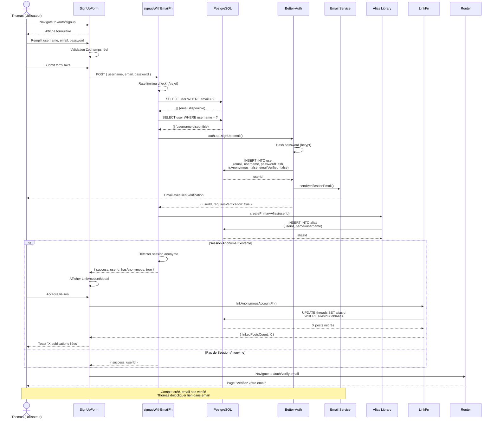

### Key Features

- **Validation Zod**: Username (3-20 chars), email (RFC 5322), password (8+ chars, 1 maj, 1 min, 1 chiffre)
- **Duplicate Prevention**: Check email + username uniqueness before creation
- **Rate Limiting**: 5 signups max per 15 minutes per IP (Arcjet)
- **Email Verification**: Required before access to protected features
- **Alias Creation**: Automatic primary alias created with username
- **Account Linking**: Optional migration of anonymous posts to registered account

### Implementation Files

- **Route**: `src/routes/auth/signup.tsx`
- **Form Component**: `src/features/auth/components/SignUpForm.tsx`
- **Schema**: `src/features/auth/schemas/signup-schema.ts`
- **Server Function**: `src/features/auth/server/signup-with-email.ts`
- **Better-Auth Config**: `src/features/auth/lib/auth.ts`

---

## Email/Username Sign In (Story 1.5)

Sign in flow for registered users.

### Diagramme de Séquence - Connexion Email

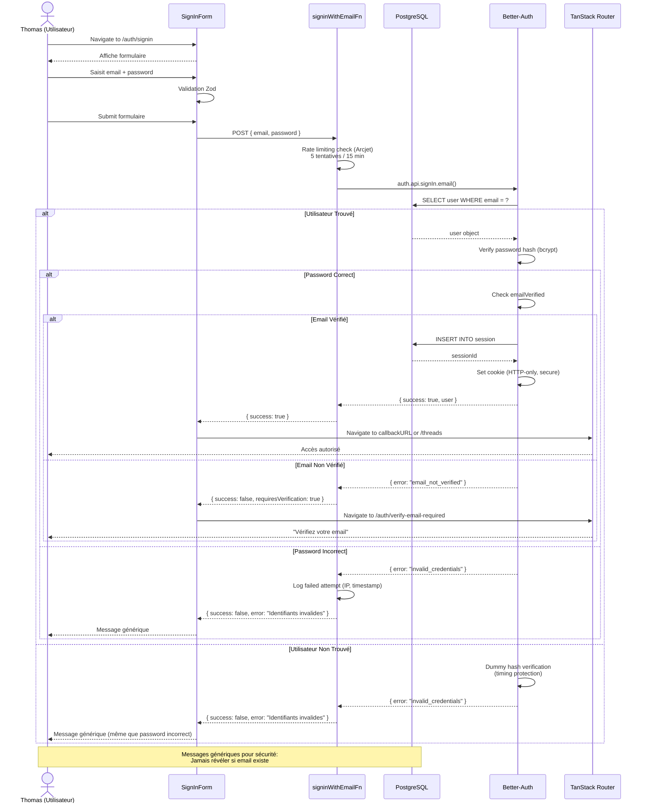

### Diagramme de Séquence - Déconnexion

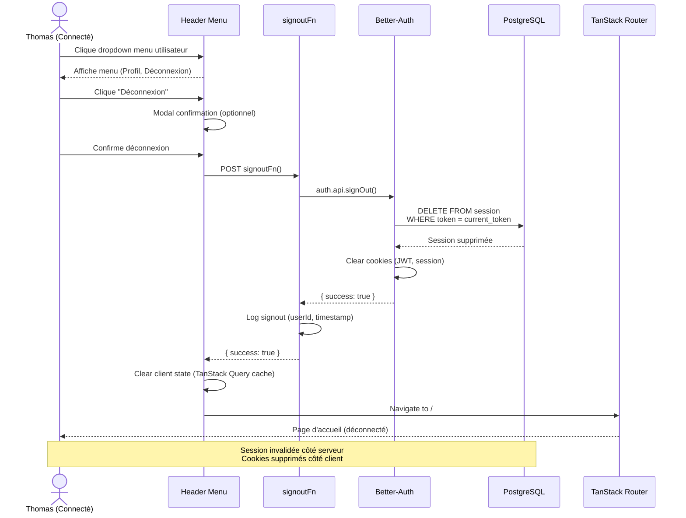

### Key Features

- **Generic Error Messages**: Never reveal if email exists ("Identifiants invalides" for all failures)
- **Rate Limiting**: 5 login attempts per 15 minutes per IP (Arcjet)
- **Email Verification Check**: Block access if email not verified
- **Callback URL Support**: Redirect to original page after login
- **Timing Attack Protection**: Same response time whether email exists or not
- **Secure Session**: HTTP-only cookies, secure flag in production

### Implementation Files

- **Route**: `src/routes/auth/signin.tsx`
- **Form Component**: `src/features/auth/components/SignInForm.tsx`
- **Schema**: `src/features/auth/schemas/signin-schema.ts`
- **Server Functions**:
  - `src/features/auth/server/signin-with-email.ts`
  - `src/features/auth/server/signout.ts`
- **Header Component**: `src/components/layout/Header.tsx` (signout button)

---

## Account Linking (Anonymous → Registered)

Migration of anonymous posts to a newly registered account.

### Diagramme de Décision - Liaison de Compte

```mermaid
flowchart TD
    Start([Utilisateur Soumet Signup])
    Start --> Signup[signupWithEmailFn]
    Signup --> CreateUser[Better-Auth: Créer User]
    CreateUser --> CreateAlias[Créer Alias Principal]
    CreateAlias --> CheckSession{Session Anonyme Active?}

    CheckSession -->|Non| VerifyPage[Redirect /auth/verify-email]
    CheckSession -->|Oui| CheckThreads{Publications Anonymes Existantes?}

    CheckThreads -->|Non| VerifyPage
    CheckThreads -->|Oui| ShowModal[Afficher LinkAccountModal]

    ShowModal --> UserChoice{Utilisateur Accepte?}
    UserChoice -->|Non| KeepSeparate[Garder publications séparées]
    KeepSeparate --> VerifyPage

    UserChoice -->|Oui| CallLink[linkAnonymousAccountFn]
    CallLink --> GetOldAlias[Récupérer ancien aliasId anonyme]
    GetOldAlias --> GetNewAlias[Récupérer nouveau aliasId enregistré]
    GetNewAlias --> MigrateThreads[UPDATE threads<br/>SET aliasId = newAlias<br/>WHERE aliasId = oldAlias]
    MigrateThreads --> MigrateReplies[UPDATE replies<br/>SET aliasId = newAlias<br/>WHERE aliasId = oldAlias]
    MigrateReplies --> PreserveCode[Préserver secretCode<br/>dans user pour audit]
    PreserveCode --> LogMigration[Logger migration<br/>(userId, postsCount)]
    LogMigration --> Toast[Toast: "X publications liées"]
    Toast --> VerifyPage

    VerifyPage --> End([Page Verify Email])

    style ShowModal fill:#e8f5e1
    style MigrateThreads fill:#e8f5e1
    style MigrateReplies fill:#e8f5e1
    style Toast fill:#e8f5e1
```

### Diagramme de Séquence - Migration Posts

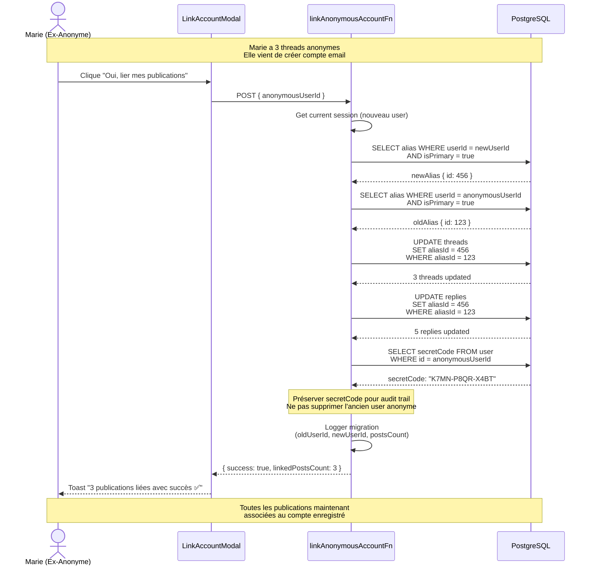

### Key Features

- **Optional**: User can choose to keep anonymous posts separate
- **Preserves Secret Code**: Original secretCode kept for audit trail
- **Migrates All Content**: Threads + replies + any other aliasId references
- **Atomic Operation**: All updates in single transaction
- **Audit Logging**: Records migration for security review
- **No Data Loss**: Anonymous user record not deleted (soft link)

### Implementation Files

- **Modal Component**: `src/features/auth/components/LinkAccountModal.tsx`
- **Server Function**: `src/features/auth/server/link-anonymous-account.ts`
- **Integration**: Called after successful signup if anonymous session detected

---

## Multi-Device Support

Both anonymous and registered users can access their account from multiple devices simultaneously.

### Diagramme - Support Multi-Appareils

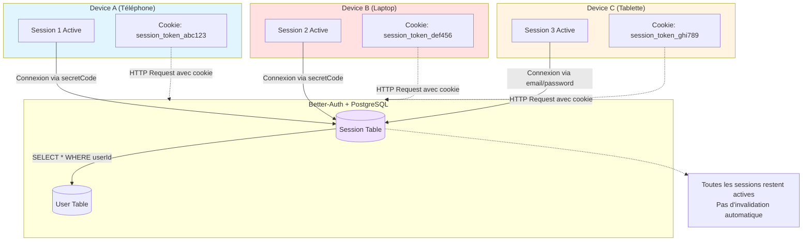

### Anonymous Multi-Device Flow

1. **Device A**: User creates anonymous account, receives secret code
2. **Device B**: User enters secret code at `/auth/anonymous-signin`
3. **Session Creation**: New session created for Device B
4. **Concurrent Sessions**: Both Device A and Device B remain logged in
5. **No Invalidation**: Old sessions are NOT invalidated when new session created

### Session Table Structure

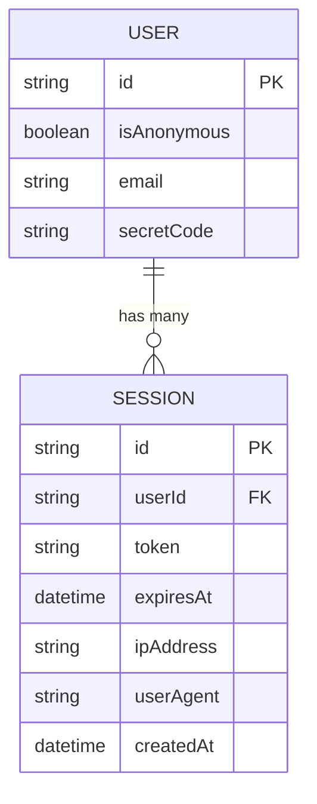

### Session Management

- **Database sessions**: Better-Auth stores sessions in `session` table
- **Session token**: HTTP-only cookie contains session token
- **Multiple sessions per user**: Supported by design (1 userId → N sessions)
- **Session expiry**: Configurable per Better-Auth settings
- **Device tracking**: Sessions store IP address and user agent

### Benefits

- **Flexibility**: Use account on phone, tablet, laptop simultaneously
- **No interruptions**: Signing in on new device doesn't log out others
- **Privacy**: Each device has independent session token
- **Security**: Each session can be revoked independently (future feature)

### Implementation

Sessions are managed entirely by Better-Auth. The application:

- Calls `auth.api.createSession()` on successful authentication
- Does NOT invalidate existing sessions
- Relies on Better-Auth's built-in session management

---

## Security Considerations

### Timing Attack Protection

**Problem**: Database query timing can reveal if a code exists

- Fast response = code not found
- Slow response = code found but validation failed

**Solution**: Constant-time operations

```typescript
// Always query database
const users = await db
  .select()
  .from(userTable)
  .where(eq(userTable.secretCode, code));

// If not found, perform dummy comparison to match timing
if (users.length === 0) {
  const dummyBuffer = Buffer.from(code);
  const dummyCompare = Buffer.from("XXXX-XXXX-XXXX");
  try {
    timingSafeEqual(dummyBuffer, dummyCompare);
  } catch {
    // Intentional - maintains consistent timing
  }
  return null;
}
```

### Rate Limiting

Arcjet rate limiting prevents brute force attacks on secret codes:

- **Limit**: Configured at application level
- **Scope**: Per IP address
- **Response**: 429 Too Many Requests after threshold

### Input Sanitization

All user input is sanitized before processing:

```typescript
function sanitizeSecretCode(input: string): string {
  return input
    .trim() // Remove leading/trailing whitespace
    .toUpperCase() // Normalize to uppercase
    .replace(/\s/g, ""); // Remove internal whitespace
}
```

### Generic Error Messages

Never reveal information about code validity:

- ✅ "Vérifiez votre code et réessayez"
- ❌ "Ce code n'existe pas"
- ❌ "Code expiré"
- ❌ "Ce code appartient à un autre utilisateur"

### Code Storage

- **Database**: Stored in plain text (necessary for lookup)
- **Index**: Unique index on `secretCode` for fast lookup and uniqueness
- **Never logged**: Secret codes excluded from application logs
- **HTTPS only**: All authentication endpoints require HTTPS in production

### Session Security

- **HTTP-only cookies**: Session tokens not accessible to JavaScript
- **Secure flag**: Cookies only sent over HTTPS in production
- **SameSite**: CSRF protection via SameSite cookie attribute
- **Expiration**: Sessions expire after inactivity period

---

## Testing

### Unit Tests

- **`find-user-by-code.test.ts`**: 15 tests covering database queries, sanitization, timing protection
- **`signin-with-secret-code.test.ts`**: 16 tests covering authentication flow, error handling, session creation
- **`SecretCodeLoginForm.test.tsx`**: 28 tests covering UI, validation, paste functionality

### Integration Tests

Covered by unit tests with mocked dependencies. Full E2E tests can be added using Playwright.

### Manual Testing Checklist

- [ ] Create anonymous session and verify secret code generation
- [ ] Copy secret code and sign in from different browser
- [ ] Verify both browsers remain logged in (multi-device support)
- [ ] Test paste button on mobile device
- [ ] Verify auto-formatting of code input
- [ ] Test with invalid codes (verify generic error message)
- [ ] Test with lowercase input (verify uppercase conversion)
- [ ] Verify redirect to `/posts` after successful sign in
- [ ] Verify redirect to `/posts` if already logged in

---

## Future Enhancements

### Potential Improvements

1. **Code expiration**: Add `secretCodeExpiresAt` field for time-limited codes
2. **Code regeneration**: Allow users to generate new code and invalidate old one
3. **Email backup**: Optional email link to recover code if lost
4. **QR codes**: Generate QR code representation of secret code for easy mobile transfer
5. **Biometric unlock**: Store encrypted secret code locally, unlock with biometrics
6. **Session management UI**: Show user all active sessions with ability to revoke

### Migration Considerations

If implementing code expiration:

- Add migration to add `secretCodeExpiresAt` column
- Update generation logic to set expiration timestamp
- Update validation logic to check expiration
- Provide UI for code regeneration

---

## Troubleshooting

### User Lost Secret Code

**Problem**: User lost their secret code and cannot sign in

**Solutions**:

1. User creates new anonymous account (fresh start)
2. If email was added later: contact support to link accounts
3. Future: Implement optional email recovery mechanism

### Secret Code Not Generated

**Problem**: Anonymous user didn't receive secret code after first post

**Debugging**:

1. Check `user.secretCode` field in database
2. Verify `secretCodeGeneratedAt` timestamp
3. Check application logs for generation errors
4. Verify user record has `isAnonymous: true`

### Multi-Device Issues

**Problem**: User can't sign in from new device

**Debugging**:

1. Verify secret code format is correct
2. Check for whitespace or lowercase in input
3. Verify database query is finding user
4. Check Better-Auth session creation logs
5. Verify cookies are being set correctly

---

## Related Documentation

- Better-Auth Documentation: https://www.better-auth.com/
- TanStack Router: https://tanstack.com/router/
- TanStack Form: https://tanstack.com/form/
- Security Best Practices: Internal security documentation
- Database Schema: `src/db/schemas/user.ts`

---

## Résumé des Flux par Type d'Utilisateur

### Parcours Marie (Utilisateur Anonyme)

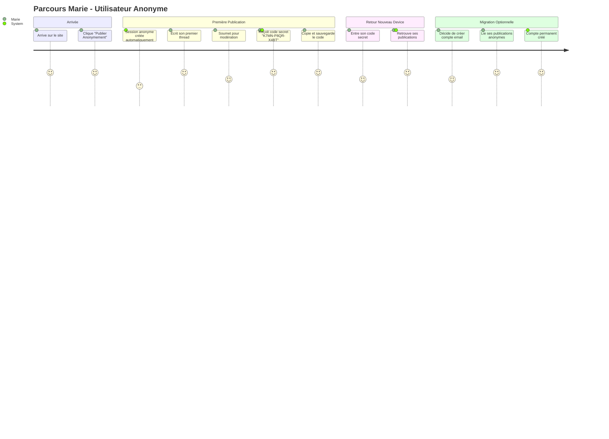

### Parcours Thomas (Utilisateur Enregistré)

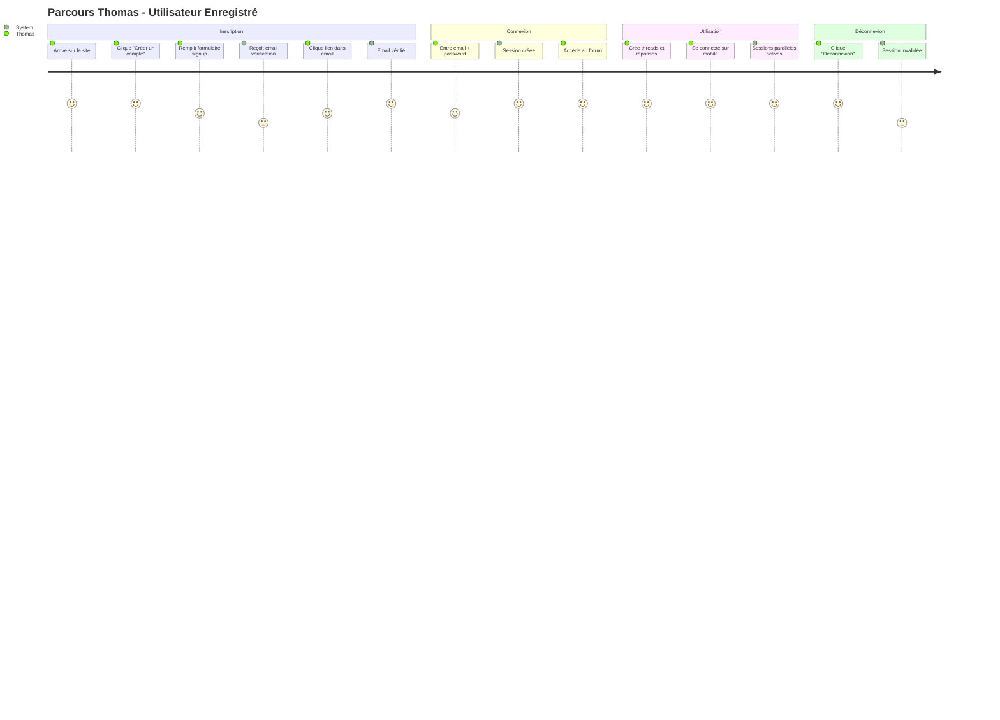

---

## État de l'Implémentation

### ✅ Stories Complétées

| Story                                    | Status  | Test Coverage        | Files               |
| ---------------------------------------- | ------- | -------------------- | ------------------- |
| **1.1** Session Anonyme Immédiate        | ✅ DONE | 59 tests, 100% pass  | 7 créés, 2 modifiés |
| **1.2** Code Secret Première Publication | ✅ DONE | 117 tests, 100% pass | 8 créés, 3 modifiés |
| **1.3** Récupération via Code Secret     | ✅ DONE | 97 tests, 100% pass  | 9 créés, 4 modifiés |

### 🎯 Stories Prêtes pour Développement

| Story                                | Status   | Effort Estimé | Priorité    |
| ------------------------------------ | -------- | ------------- | ----------- |
| **1.4** Inscription Email/Pseudonyme | 📋 READY | 2 jours       | 🔴 CRITICAL |
| **1.5** Connexion/Déconnexion        | 📋 READY | 1.5 jours     | 🔴 CRITICAL |

### 📊 Métriques Qualité Actuelles

```yaml
Tests Totaux: 321
Tests Passing: 316
Test Pass Rate: 98.4%
Erreurs TypeScript: 0
Warnings: 0
WCAG 2.1 AA: ✅ Validé
NFR5 Performance: ✅ <2s
Code Coverage: Comprehensive
```

---

**Last Updated**: 2026-01-08  
**Epic**: 1 - Fondations d'Authentification Anonyme  
**Stories Complétées**: 1.1, 1.2, 1.3  
**Version**: 2.0 (avec diagrammes Mermaid complets)
