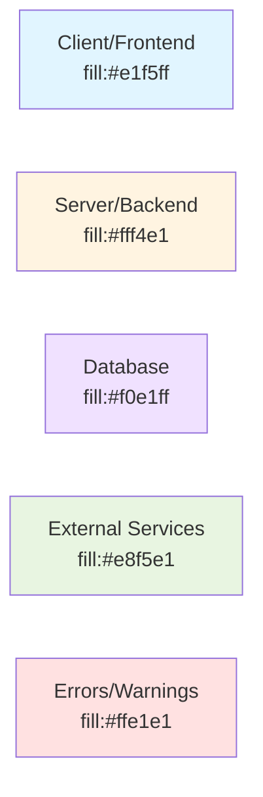

# Index des Diagrammes - Parlons Violence

**Dernière mise à jour:** 2026-01-22

Ce répertoire contient tous les diagrammes techniques et architecturaux du projet, créés avec Mermaid.

---

## 📊 Diagrammes Disponibles

### 1. Vue d'Ensemble du Système

**Fichier:** [`system-overview.md`](./system-overview.md)

**Contenu:**
- Architecture globale (Client, Server, Database, External)
- Stack détaillé (Frontend, Backend)
- Flux de données (Query, Mutation)
- Modèle de données simplifié (ERD)
- Flux utilisateur principal (Journey)
- Sécurité et anonymat (couches de protection)
- Performance et scalabilité
- Monitoring et observabilité
- Pipeline CI/CD

**Utilisé pour:**
- Comprendre l'architecture complète en un coup d'œil
- Onboarding nouveaux développeurs
- Présentation aux stakeholders
- Documentation technique de référence

---

### 2. Système d'Alias - ERD Complet

**Fichier:** [`alias-system-erd.md`](./alias-system-erd.md)

**Contenu:**
- Vue complète des relations entre toutes les tables
- Focus sur la séparation User ↔ Contenu Public
- Cardinalités détaillées
- Exemples de requêtes SQL
- Contraintes d'intégrité (PK, FK, Unique, CASCADE)
- Index recommandés pour performance
- Migration et évolution du schéma
- Sécurité des données et principe de moindre privilège

**Utilisé pour:**
- Comprendre le système d'anonymat
- Écrire des requêtes SQL correctes
- Planifier des migrations de schéma
- Auditer la sécurité des données

---

### 3. Architecture du Système de Logging

**Fichier:** [`logging-architecture.md`](./logging-architecture.md)

**Contenu:**
- Vue d'ensemble (Application, Context, Winston, Output)
- Flux de données détaillé (avec et sans middleware)
- Composants du système (AsyncLocalStorage, Formatters, Transports)
- Niveaux de log et hiérarchie
- Auto-redaction des données sensibles
- Rotation des fichiers et politique de rétention
- Exemples d'intégration (Server Functions, Services)
- Formats de sortie (Dev, Production)
- Intégrations externes (Datadog, ELK)
- Performance et overhead
- Tracing avec correlation ID
- Monitoring et alertes

**Utilisé pour:**
- Comprendre le système de logging
- Implémenter le logging dans de nouvelles fonctionnalités
- Configurer les transports et destinations
- Debugger avec les correlation IDs
- Optimiser les performances

---

## 🗺️ Navigation Rapide

### Par Besoin

| Besoin | Diagramme | Section |
|--------|-----------|---------|
| **Comprendre l'architecture globale** | [System Overview](./system-overview.md) | Architecture Globale |
| **Comprendre l'anonymat** | [Alias System ERD](./alias-system-erd.md) | Focus: Anonymat Garanti |
| **Écrire des requêtes SQL** | [Alias System ERD](./alias-system-erd.md) | Exemples de Requêtes |
| **Implémenter le logging** | [Logging Architecture](./logging-architecture.md) | Exemples d'Intégration |
| **Debugger avec correlationId** | [Logging Architecture](./logging-architecture.md) | Tracing avec Correlation ID |
| **Optimiser les performances** | [System Overview](./system-overview.md) | Performance et Scalabilité |
| **Comprendre les flux de données** | [System Overview](./system-overview.md) | Flux de Données |
| **Planifier une migration DB** | [Alias System ERD](./alias-system-erd.md) | Migration et Évolution |

### Par Rôle

#### 👨‍💻 Développeur Backend
1. [Alias System ERD](./alias-system-erd.md) - Comprendre le modèle de données
2. [Logging Architecture](./logging-architecture.md) - Implémenter le logging
3. [System Overview](./system-overview.md) - Flux de données

#### 👩‍💻 Développeur Frontend
1. [System Overview](./system-overview.md) - Stack Frontend + Flux
2. [Logging Architecture](./logging-architecture.md) - Logger côté client

#### 🏗️ Architecte
1. [System Overview](./system-overview.md) - Vue d'ensemble complète
2. [Alias System ERD](./alias-system-erd.md) - Modèle de données détaillé
3. [Logging Architecture](./logging-architecture.md) - Observabilité

#### 🔒 Security Engineer
1. [Alias System ERD](./alias-system-erd.md) - Sécurité des données
2. [System Overview](./system-overview.md) - Couches de protection
3. [Logging Architecture](./logging-architecture.md) - Auto-redaction

---

## 📚 Diagrammes dans d'Autres Documents

Ces documents contiennent également d'excellents diagrammes Mermaid:

### [docs/auth-flows.md](../auth-flows.md)
- Diagramme global des flux d'authentification
- Séquence: Session anonyme
- Séquence: Génération code secret
- Séquence: Récupération via code secret
- Séquence: Inscription email
- Séquence: Connexion email
- Séquence: Déconnexion
- Décision: Liaison de compte
- Séquence: Migration posts
- Support multi-appareils
- Journey: Parcours Marie (anonyme)
- Journey: Parcours Thomas (enregistré)

### [docs/architecture-flux-threads-posts.md](../architecture-flux-threads-posts.md)
- Parcours 1: Marie (Anonyme) - Première publication
- Parcours 2: Thomas - Réponse à une publication
- Parcours 3: Marie revient (autre appareil)

### [project-context.md](../project-context.md)
- Diagrammes intégrés dans le contexte global

---

## 🎨 Conventions de Style

### Couleurs

Nous utilisons un code couleur cohérent dans tous les diagrammes:

### Types de Diagrammes

| Type Mermaid | Usage | Exemple |
|--------------|-------|---------|
| `flowchart` | Architecture, flux de décision | System Overview |
| `sequenceDiagram` | Interactions temporelles | Auth Flows |
| `erDiagram` | Relations de données | Alias System ERD |
| `journey` | Parcours utilisateur | System Overview |

---

## ✅ Validation des Diagrammes

Tous les diagrammes ont été validés syntaxiquement selon les standards:

- ✅ Syntaxe Mermaid correcte
- ✅ Types de diagrammes appropriés
- ✅ Labels descriptifs (pas "A", "B", mais "Client", "Server")
- ✅ Code couleur cohérent
- ✅ Lisibilité optimale (5-15 nœuds par diagramme)
- ✅ Relations clairement étiquetées

---

## 🔄 Maintenance

### Quand Mettre à Jour

Mettez à jour les diagrammes lors de:
- Changements d'architecture majeurs
- Ajout de nouvelles fonctionnalités importantes
- Modifications du modèle de données
- Changements dans les flux d'authentification
- Ajout/suppression de services externes

### Comment Contribuer

1. Suivre les conventions de style
2. Utiliser le code couleur standard
3. Tester la syntaxe Mermaid avec [Mermaid Live Editor](https://mermaid.live)
4. Mettre à jour l'index (ce fichier) si nouveau diagramme
5. Ajouter la date de dernière mise à jour

---

## 📖 Ressources

### Outils

- [Mermaid Live Editor](https://mermaid.live) - Éditeur en ligne
- [Mermaid Documentation](https://mermaid.js.org) - Documentation officielle
- [VS Code Extension](https://marketplace.visualstudio.com/items?itemName=bierner.markdown-mermaid) - Preview Mermaid

### Documentation Connexe

- [Documentation Validation Report](../DOCUMENTATION-VALIDATION-REPORT.md)
- [Project Context](../project-context.md)
- [Auth Flows](../auth-flows.md)
- [Architecture Flows](../architecture-flux-threads-posts.md)

---

**Maintenu par:** Paige (Technical Writer) + Équipe Parlons Violence
