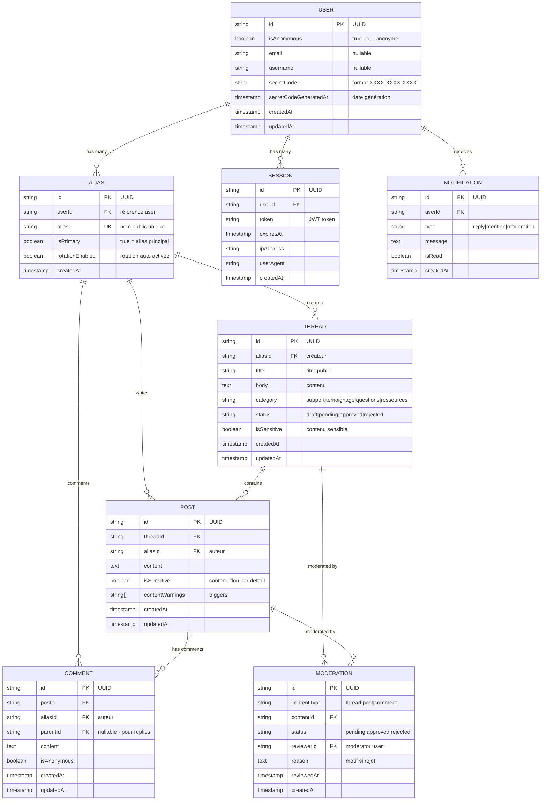
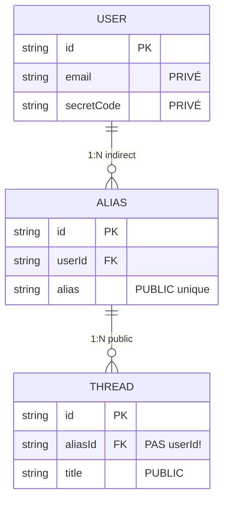
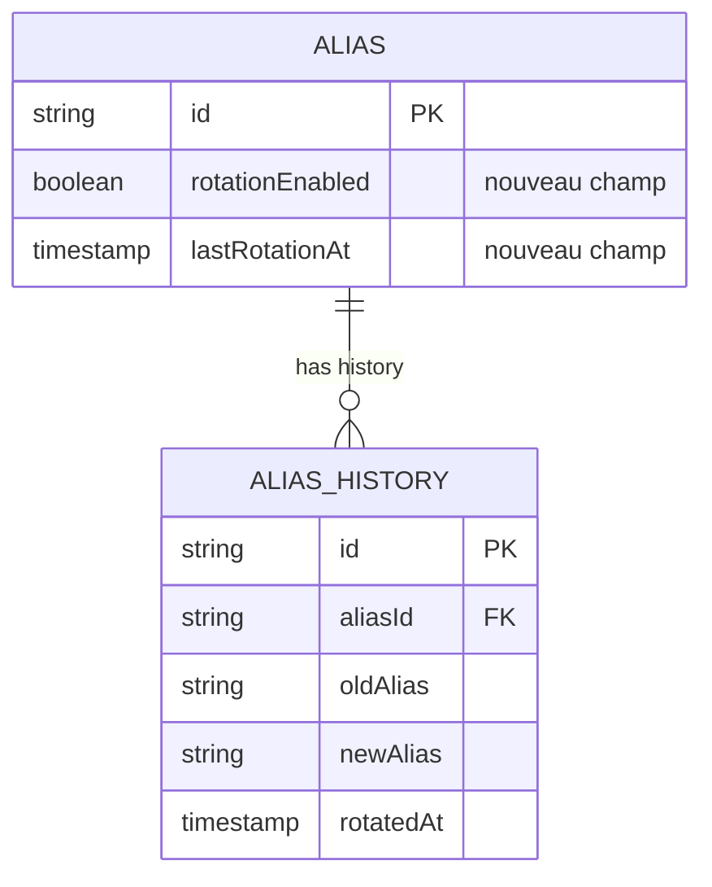

# Diagramme ERD - Système d'Alias

**Date:** 2026-01-22
**Module:** `src/features/alias`

---

## Vue Complète des Relations



---

## Focus: Anonymat Garanti

### Séparation User ↔ Contenu Public



### ✅ Protection

- Le `userId` n'apparaît **JAMAIS** dans `threads`, `posts`, ou `comments`
- Seul l'`aliasId` est stocké (référence publique)
- Impossible de lier directement un `user.email` à un `thread.title` via SQL simple

---

## Cardinalités Détaillées

### Relations 1:N

| Parent | Enfant | Cardinalité | Description |
|--------|--------|-------------|-------------|
| `USER` | `ALIAS` | 1:N | Un utilisateur peut avoir **plusieurs alias** (primaire + secondaires) |
| `USER` | `SESSION` | 1:N | Multi-device support: **plusieurs sessions actives** simultanément |
| `ALIAS` | `THREAD` | 1:N | Un alias peut créer **plusieurs threads** |
| `ALIAS` | `POST` | 1:N | Un alias peut écrire **plusieurs posts** |
| `ALIAS` | `COMMENT` | 1:N | Un alias peut commenter **plusieurs fois** |
| `THREAD` | `POST` | 1:N | Un thread contient **plusieurs posts** (réponses) |
| `POST` | `COMMENT` | 1:N | Un post peut avoir **plusieurs commentaires** |

### Relations Spéciales

| Type | Description |
|------|-------------|
| `COMMENT.parentId` | Auto-référence pour **commentaires imbriqués** (replies) |
| `ALIAS.isPrimary` | **Un seul alias principal** par utilisateur (boolean flag) |

---

## Exemples de Requêtes

### Trouver tous les threads d'un utilisateur

```sql
-- ✅ Correct: via alias
SELECT t.*
FROM threads t
JOIN alias a ON a.id = t.alias_id
WHERE a.user_id = 'user_123';

-- ❌ Impossible: pas de lien direct
SELECT t.*
FROM threads t
WHERE t.user_id = 'user_123'; -- Cette colonne n'existe PAS !
```

### Trouver tous les posts d'un utilisateur

```sql
-- ✅ Correct
SELECT p.*
FROM posts p
JOIN alias a ON a.id = p.alias_id
WHERE a.user_id = 'user_123';
```

### Lister les alias d'un utilisateur

```sql
-- Tous les alias
SELECT * FROM alias WHERE user_id = 'user_123';

-- Alias principal uniquement
SELECT * FROM alias WHERE user_id = 'user_123' AND is_primary = true;
```

### Vérifier disponibilité d'un alias

```sql
SELECT EXISTS(SELECT 1 FROM alias WHERE alias = 'MonPseudo-2024') as is_taken;
```

---

## Contraintes d'Intégrité

### Clés Primaires

- Tous les `id` sont des **UUID v4**
- Générés par Drizzle ORM (`uuid()` helper)

### Clés Étrangères

```typescript
// Drizzle Schema Example
export const alias = pgTable("alias", {
  id: uuid("id").primaryKey().defaultRandom(),
  userId: text("user_id")
    .notNull()
    .references(() => user.id, { onDelete: "cascade" }), // CASCADE DELETE
  alias: text("alias").notNull().unique(),
  isPrimary: boolean("is_primary").notNull().default(false),
  createdAt: timestamp("created_at").notNull().defaultNow(),
});
```

### Contraintes Uniques

- `alias.alias` : **Unique** (pas de doublons de noms)
- `user.email` : **Unique** (si non-null)
- `user.secretCode` : **Unique** (si non-null)

### Contraintes CASCADE

- Si un `user` est supprimé → tous ses `alias` sont supprimés
- Si un `alias` est supprimé → tous ses `threads`, `posts`, `comments` sont supprimés
- **Anonymat préservé même en cas de suppression**

---

## Indexes Recommandés

### Index Performance

```sql
-- Recherche rapide par userId
CREATE INDEX idx_alias_user_id ON alias(user_id);
CREATE INDEX idx_session_user_id ON session(user_id);

-- Recherche rapide par aliasId
CREATE INDEX idx_threads_alias_id ON threads(alias_id);
CREATE INDEX idx_posts_alias_id ON posts(alias_id);
CREATE INDEX idx_comments_alias_id ON comments(alias_id);

-- Recherche par threadId (posts d'un thread)
CREATE INDEX idx_posts_thread_id ON posts(thread_id);

-- Recherche par postId (comments d'un post)
CREATE INDEX idx_comments_post_id ON comments(post_id);

-- Commentaires imbriqués
CREATE INDEX idx_comments_parent_id ON comments(parent_id);

-- Modération
CREATE INDEX idx_moderation_content ON moderation(content_type, content_id);
CREATE INDEX idx_moderation_status ON moderation(status);

-- Notifications non lues
CREATE INDEX idx_notifications_user_unread ON notifications(user_id, is_read);
```

---

## Migration et Évolution

### Ajout d'Alias Secondaires

```typescript
// Script de migration: permettre plusieurs alias par user
// Déjà supporté par le schéma actuel (1:N relation)

// Exemple:
const secondaryAlias = await createSecondaryAlias(
  userId,
  "AliasSecondaire-2024",
  true // rotation enabled
);
```

### Rotation Automatique (Future Feature)



---

## Sécurité des Données

### Champs Sensibles

| Table | Champ | Sensibilité | Protection |
|-------|-------|-------------|-----------|
| `user` | `email` | 🔴 HAUTE | Jamais exposé dans API publiques |
| `user` | `secretCode` | 🔴 HAUTE | Redacté dans logs, unique index |
| `alias` | `userId` | 🟡 MOYENNE | Jamais exposé dans API publiques |
| `threads` | `aliasId` | 🟢 BASSE | Public (par design) |

### Principe de Moindre Privilège

```typescript
// ❌ JAMAIS faire ceci dans une API publique
export const getThreadDetails = async (threadId: string) => {
  return db
    .select()
    .from(threads)
    .leftJoin(alias, eq(threads.aliasId, alias.id))
    .leftJoin(user, eq(alias.userId, user.id)) // ❌ Expose user.email !
    .where(eq(threads.id, threadId));
};

// ✅ CORRECT
export const getThreadDetails = async (threadId: string) => {
  return db
    .select({
      id: threads.id,
      title: threads.title,
      body: threads.body,
      authorAlias: alias.alias, // ✅ Seulement l'alias public
      createdAt: threads.createdAt,
    })
    .from(threads)
    .leftJoin(alias, eq(threads.aliasId, alias.id))
    .where(eq(threads.id, threadId));
};
```

---

## Références

- [Alias README](../../src/features/alias/README.md) - Documentation complète du système
- [Project Context](../project-context.md) - Architecture globale
- [Auth Flows](./auth-flows.md) - Flux d'authentification

---

**Maintenu par:** Équipe Parlons Violence
**Dernière mise à jour:** 2026-01-22
