# Architecture du Système de Logging

**Date:** 2026-01-22
**Module:** `src/lib/logger`
**Technologie:** Winston 3.19.0 + AsyncLocalStorage

---

## Vue d'Ensemble

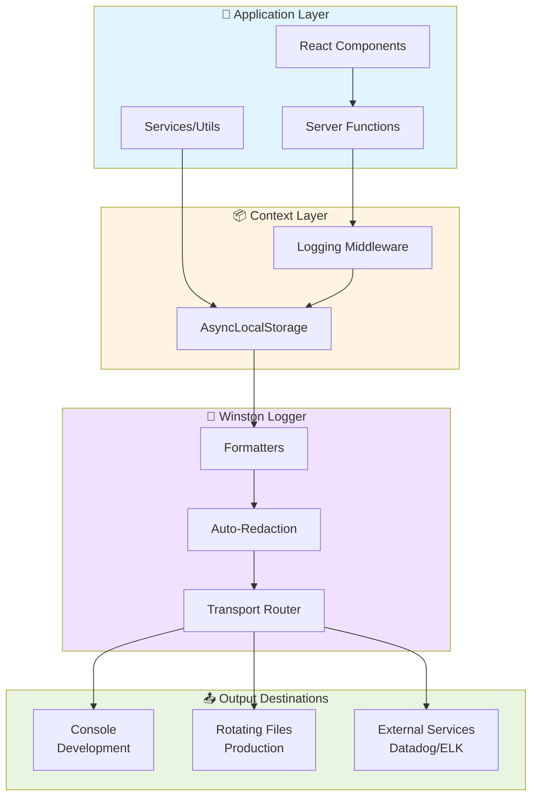

---

## Flux de Données Détaillé

### 1. Requête HTTP avec Contexte Automatique

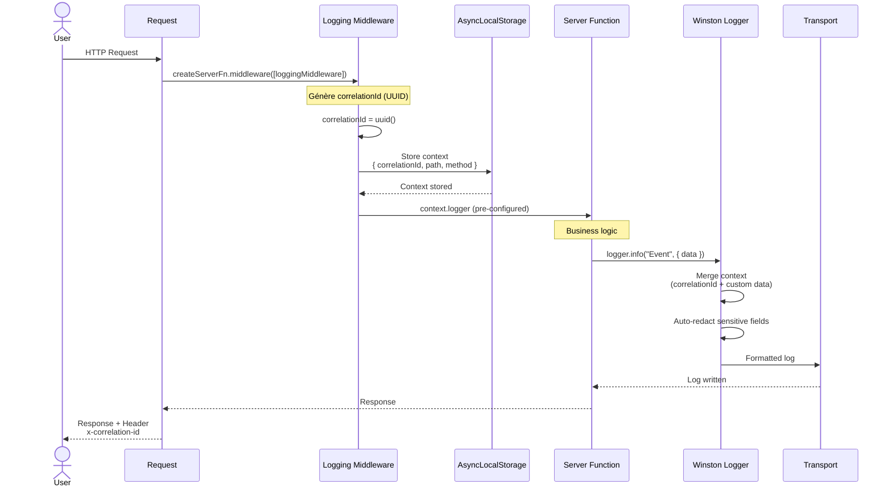

### 2. Log depuis un Service (sans middleware)

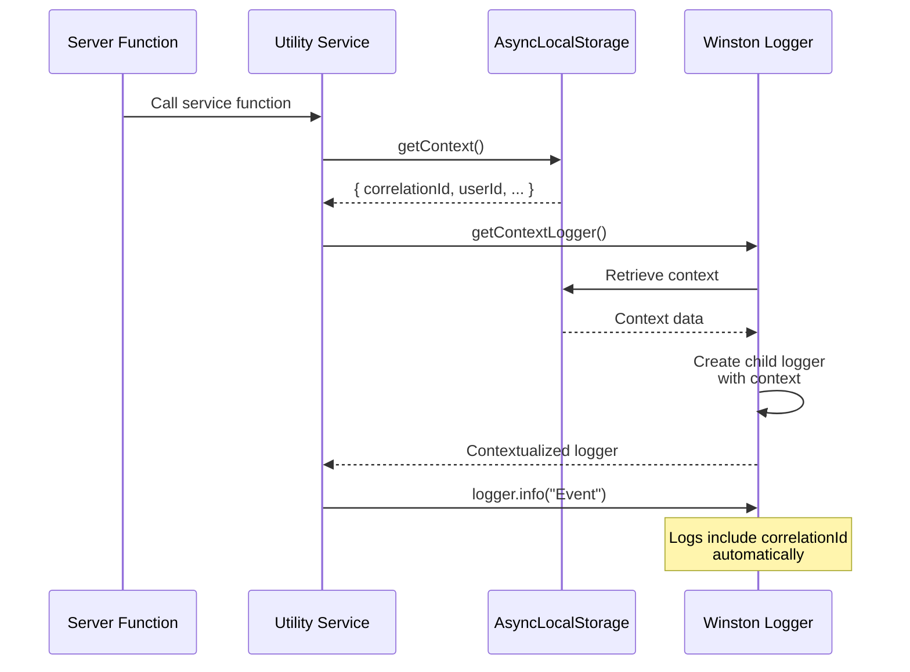

---

## Composants du Système

### AsyncLocalStorage - Propagation du Contexte

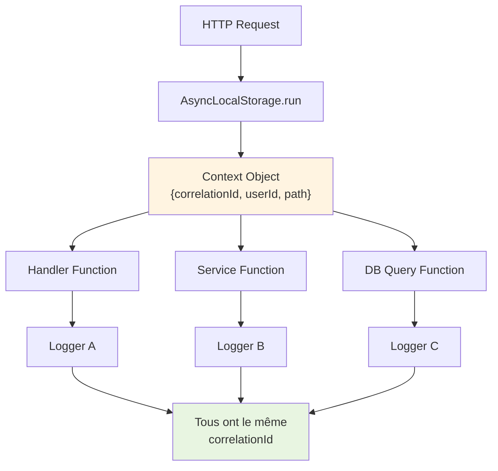

**Avantage:** Pas besoin de passer le logger en paramètre à chaque fonction!

### Winston Formatters

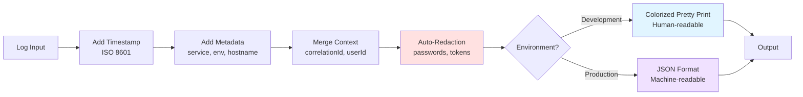

### Transports (Destinations)

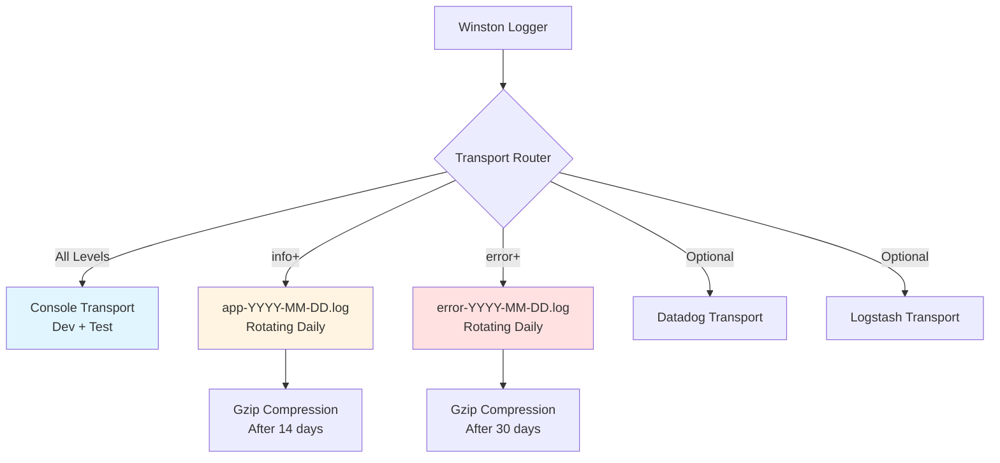

---

## Niveaux de Log

### Hiérarchie et Utilisation

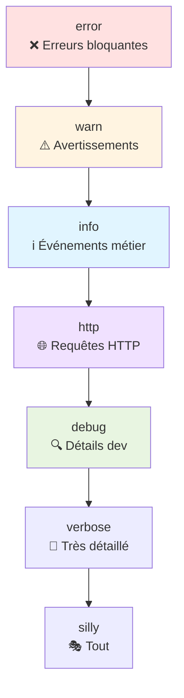

### Configuration par Environnement

| Environnement   | Niveau   | Transports Actifs                 |
| --------------- | -------- | --------------------------------- |
| **Development** | `debug`  | Console (coloré)                  |
| **Test**        | `silent` | Aucun (logs désactivés)           |
| **Production**  | `info`   | Console (JSON) + Files + External |

---

## Auto-Redaction des Données Sensibles

### Champs Redactés Automatiquement

```mermaid
flowchart LR
    Input["Log Object<br/>{<br/>  email: 'user@...',<br/>  password: 'secret123',<br/>  token: 'abc-xyz'<br/>}"]

    Input --> Scan[Scanner Récursif]

    Scan --> Check{Champ Sensible?}

    Check -->|password| Redact1[Remplacer par '[REDACTED]']
    Check -->|token| Redact2[Remplacer par '[REDACTED]']
    Check -->|apiKey| Redact3[Remplacer par '[REDACTED]']
    Check -->|Non| Keep[Conserver valeur]

    Redact1 --> Output
    Redact2 --> Output
    Redact3 --> Output
    Keep --> Output

    Output["Log Sécurisé<br/>{<br/>  email: 'user@...',<br/>  password: '[REDACTED]',<br/>  token: '[REDACTED]'<br/>}"]

    style Input fill:#ffe1e1
    style Output fill:#e8f5e1
```

### Liste des Clés Sensibles

```typescript
const SENSITIVE_KEYS = [
  "password",
  "pass",
  "token",
  "authorization",
  "auth",
  "secret",
  "apikey",
  "apiKey",
  "api_key",
  "bearer",
  "creditcard",
  "ssn",
  "secretCode", // Spécifique au projet
];
```

---

## Rotation des Fichiers

### Politique de Rétention

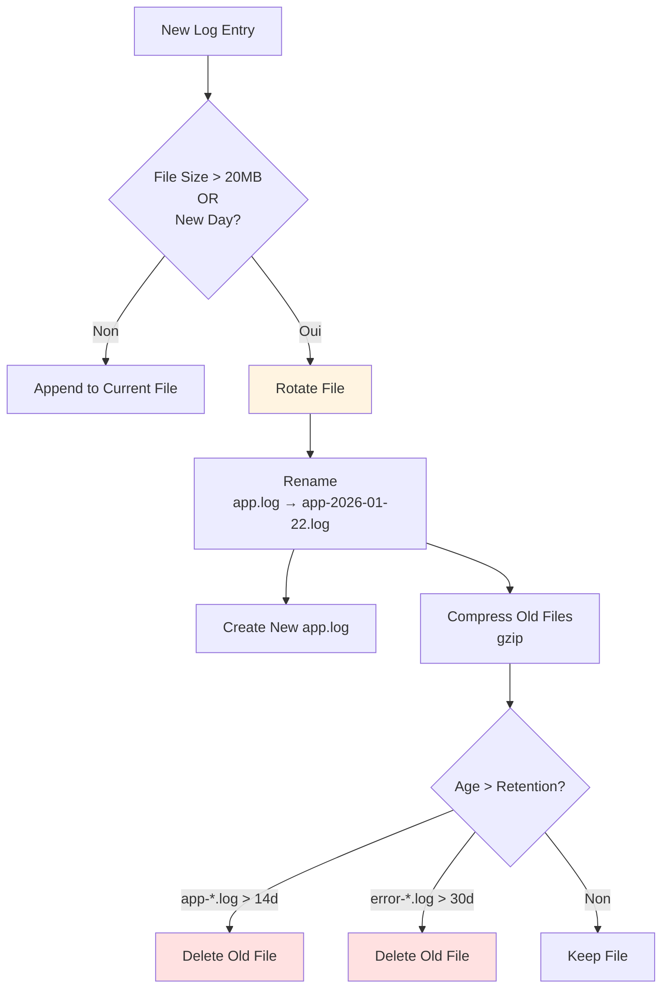

### Structure des Fichiers

```
logs/
├── app-2026-01-22.log          ← Aujourd'hui (tous niveaux info+)
├── app-2026-01-21.log.gz       ← Hier (compressé)
├── app-2026-01-20.log.gz
├── ...
├── error-2026-01-22.log        ← Aujourd'hui (erreurs uniquement)
├── error-2026-01-21.log.gz
└── error-2026-01-20.log.gz
```

---

## Exemples d'Intégration

### Server Function avec Middleware

```typescript
import { createServerFn } from "@tanstack/react-start";
import { loggingMiddleware } from "@/lib/logger";

export const createThreadFn = createServerFn({ method: "POST" })
  .middleware([loggingMiddleware])
  .handler(async ({ context, data }) => {
    // context.logger inclut automatiquement:
    // - correlationId (UUID unique)
    // - requestPath (/api/threads)
    // - method (POST)

    context.logger.info("Creating thread", {
      title: data.title,
      category: data.category,
    });

    try {
      const thread = await db.insert(threads).values(data);

      context.logger.info("Thread created", {
        threadId: thread.id,
      });

      return { success: true, thread };
    } catch (error) {
      context.logger.error("Failed to create thread", {
        error: error instanceof Error ? error.message : String(error),
        stack: error instanceof Error ? error.stack : undefined,
      });
      throw error;
    }
  });
```

### Service sans Contexte HTTP

```typescript
import { getContextLogger, withMeta } from '@/lib/logger';

export class NotificationService {
  private logger = withMeta({ service: 'NotificationService' });

  async sendEmail(userId: string, type: string) {
    const emailLogger = withMeta({
      userId,
      notificationType: type,
    });

    emailLogger.info('Sending notification email');

    try {
      await emailService.send({ ... });
      emailLogger.info('Email sent successfully');
    } catch (error) {
      emailLogger.error('Failed to send email', {
        error: error instanceof Error ? error.message : String(error),
      });
      throw error;
    }
  }
}
```

---

## Formats de Sortie

### Développement (Console Pretty)

```
2026-01-22 10:30:45.123 [info] User created thread {
  "correlationId": "f47ac10b-58cc-4372-a567-0e02b2c3d479",
  "userId": "user_123",
  "threadId": "thread_456",
  "title": "Besoin d'aide"
}
```

### Production (JSON)

```json
{
  "level": "info",
  "message": "User created thread",
  "timestamp": "2026-01-22T10:30:45.123Z",
  "service": "parlons-violence",
  "env": "production",
  "hostname": "app-server-01",
  "correlationId": "f47ac10b-58cc-4372-a567-0e02b2c3d479",
  "userId": "user_123",
  "threadId": "thread_456",
  "title": "Besoin d'aide"
}
```

---

## Intégrations Externes

### Datadog

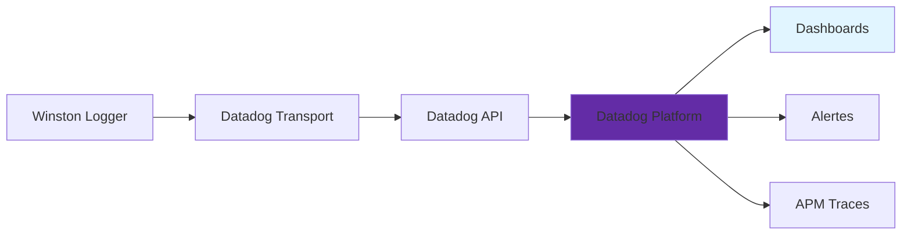

### ELK Stack

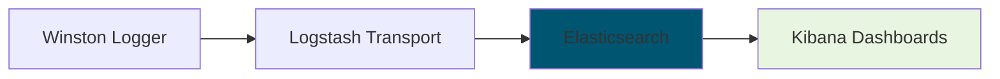

---

## Performance et Overhead

### Impact par Niveau de Log

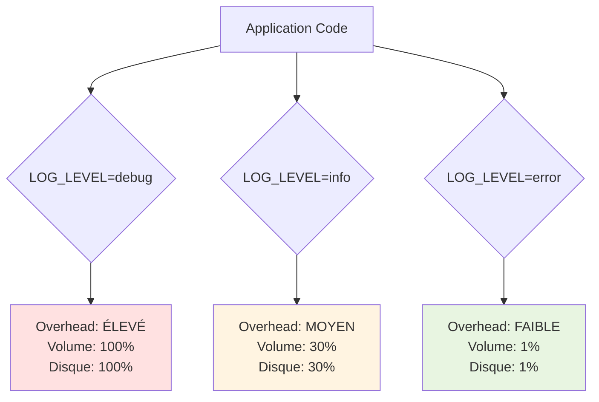

### Recommandations

| Environnement  | Niveau   | Justification                     |
| -------------- | -------- | --------------------------------- |
| **Dev**        | `debug`  | Tous les détails pour debugger    |
| **Staging**    | `info`   | Événements métier sans spam       |
| **Production** | `info`   | Balance performance/observabilité |
| **Test**       | `silent` | Pas de pollution des logs de test |

---

## Tracing avec Correlation ID

### Traçabilité Complète

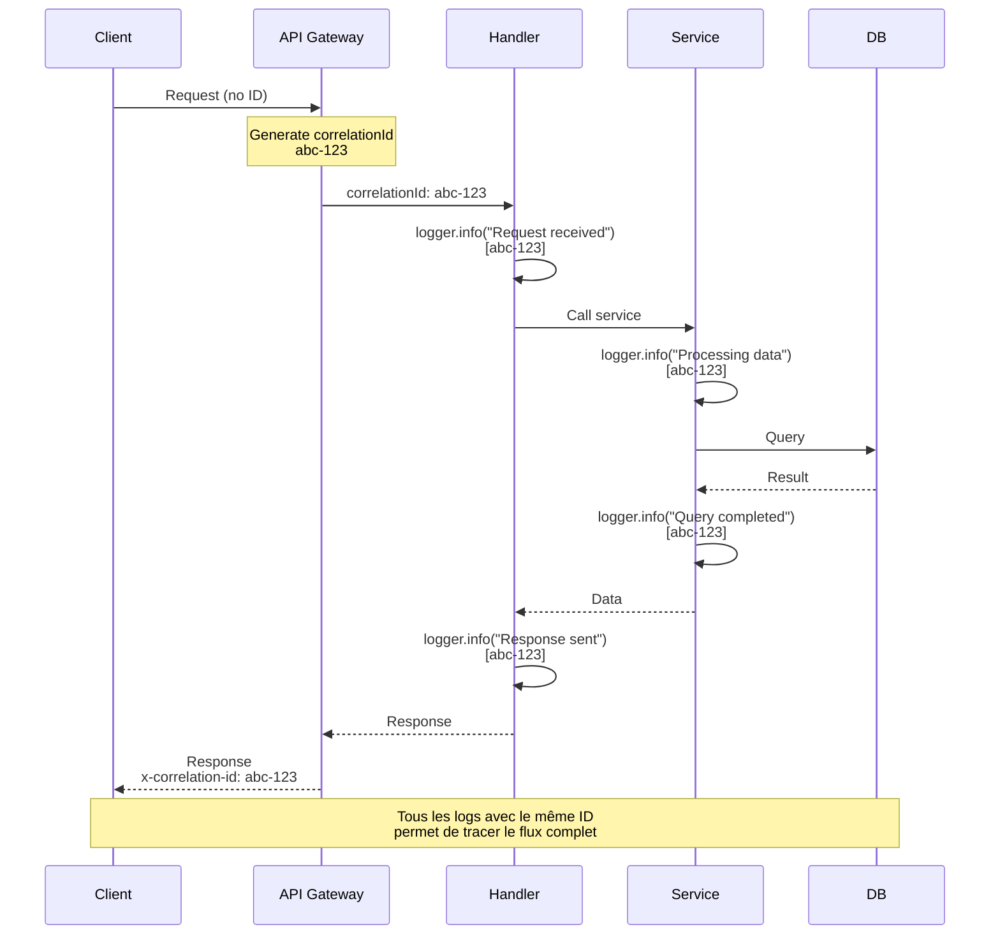

### Recherche dans les Logs

```bash
# Trouver tous les logs d'une requête
grep "abc-123" logs/app-2026-01-22.log

# Avec jq pour JSON
cat logs/app-2026-01-22.log | jq 'select(.correlationId == "abc-123")'
```

---

## Monitoring et Alertes

### Métriques Clés

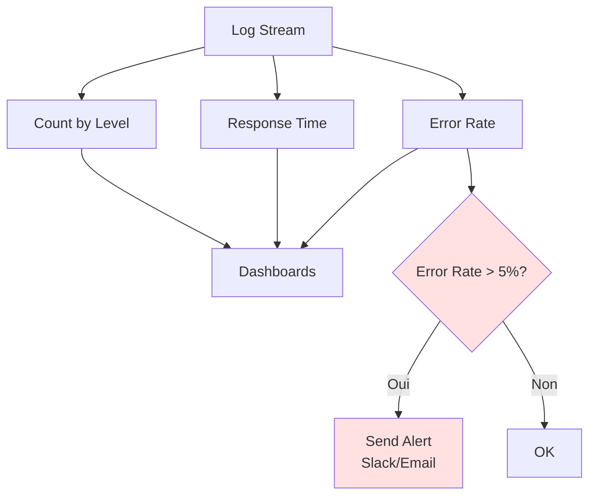

---

## Références

- [Logger README](../../src/lib/logger/README.md) - Documentation complète
- [Logger USAGE](../../src/lib/logger/USAGE.md) - Guide d'utilisation
- [Winston Documentation](https://github.com/winstonjs/winston)
- [AsyncLocalStorage Node.js](https://nodejs.org/api/async_context.html)

---

**Maintenu par:** Équipe Parlons Violence
**Dernière mise à jour:** 2026-01-22
