# Vue d'Ensemble du Système - Parlons Violence

**Date:** 2026-01-22
**Version:** 1.0

---

## Architecture Globale

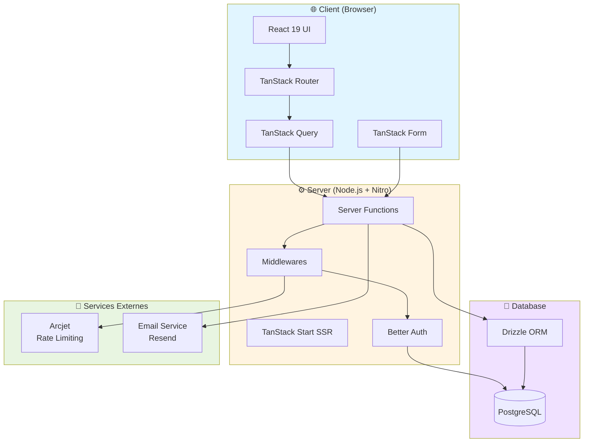

---

## Stack Détaillé

### Frontend

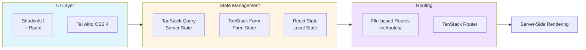

### Backend

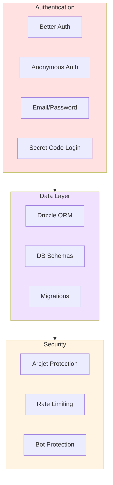

---

## Flux de Données

### Lecture de Données (Query)

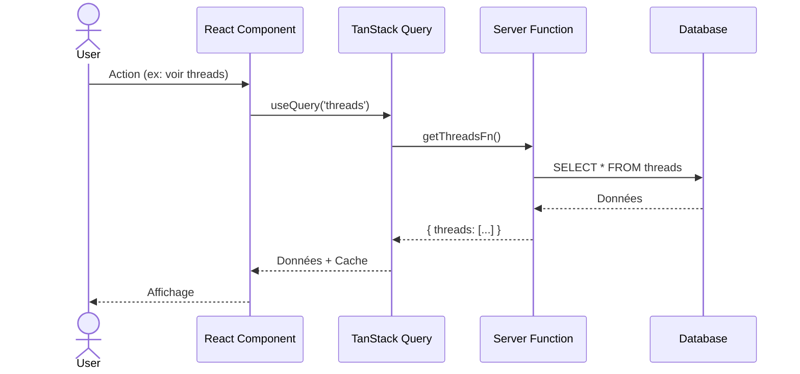

### Écriture de Données (Mutation)

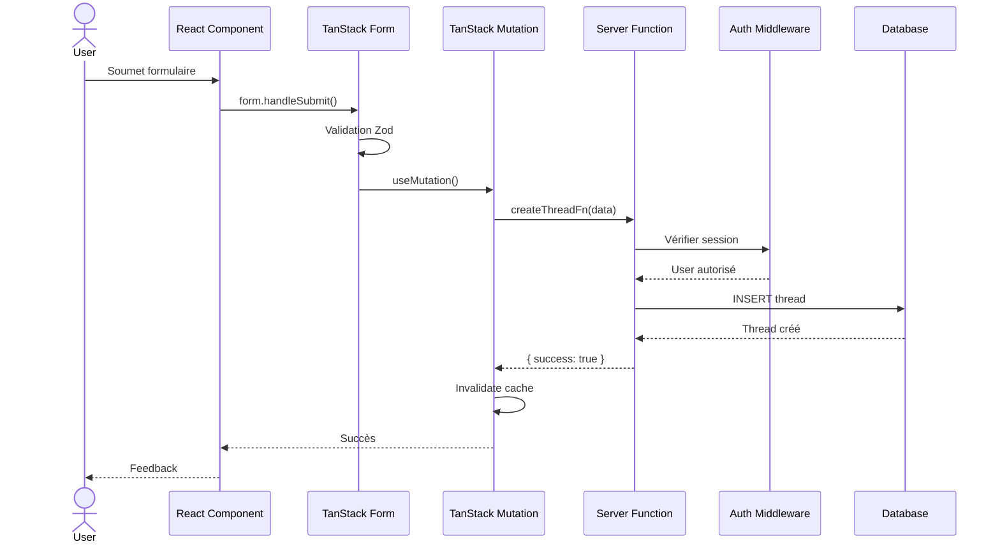

---

## Modèle de Données Simplifié

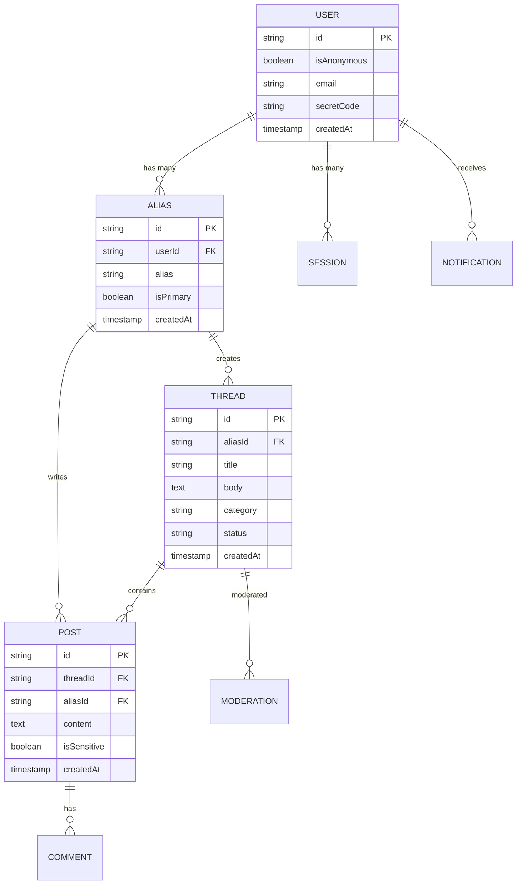

---

## Flux Utilisateur Principal

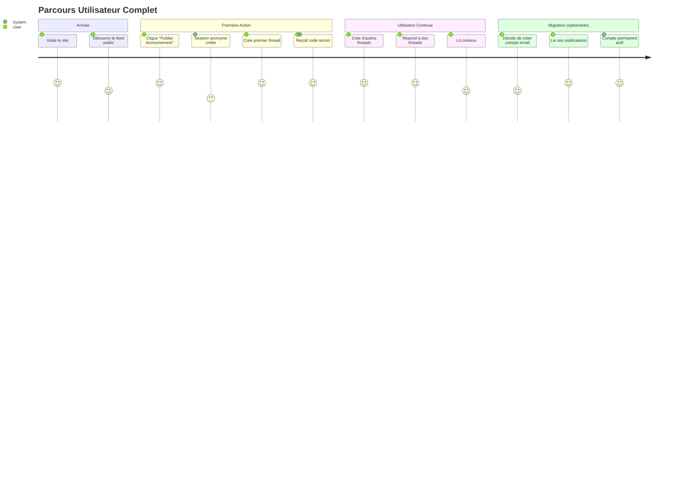

---

## Sécurité et Anonymat

### Couches de Protection

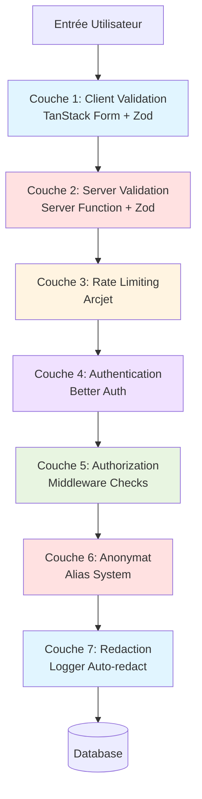

### Anonymat Garanti

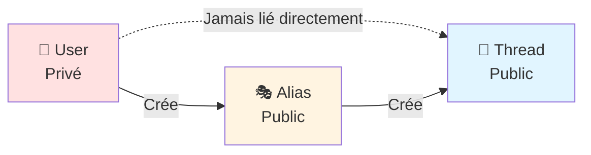

---

## Performance et Scalabilité

### Stratégie de Cache

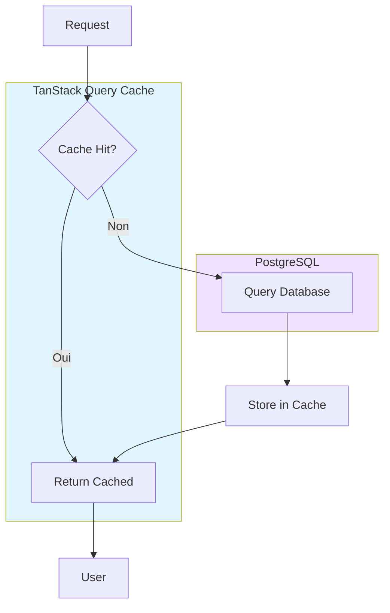

### Optimisations

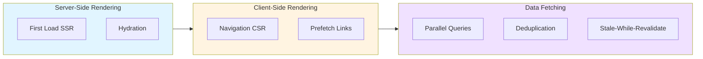

---

## Monitoring et Observabilité

### Architecture de Logging

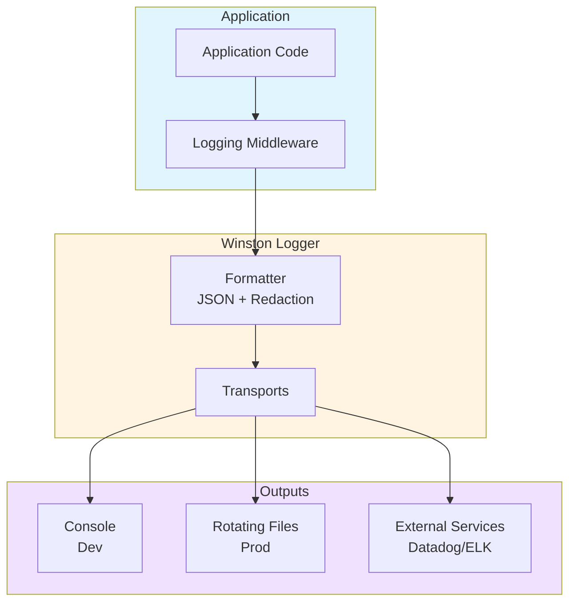

### Contexte de Corrélation

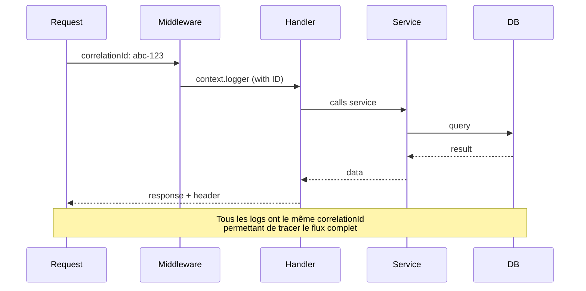

---

## Déploiement

### Pipeline CI/CD (Futur)

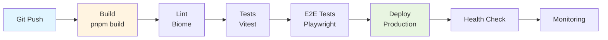

---

## Références

- [Project Context](../project-context.md) - Contexte complet du projet
- [Architecture Flows](./architecture-flux-threads-posts.md) - Détail des flux
- [Auth Flows](./auth-flows.md) - Flux d'authentification détaillés
- [Documentation Validation Report](./DOCUMENTATION-VALIDATION-REPORT.md) - Rapport de validation

---

**Maintenu par:** Équipe Parlons Violence
**Dernière mise à jour:** 2026-01-22
