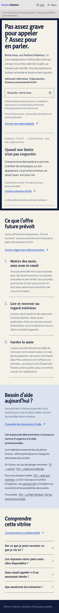
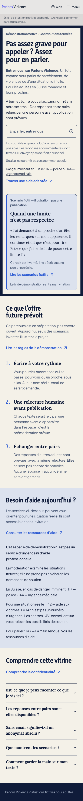

# Entre nous — revue UX mobile et preuves locales

Base : `17637174b9b230f52765adf82d9de7176d3a7441` (`origin/dev` récupéré le 10 octobre 2026). Branche : `ux/entre-nous-mobile-polish`. Le checkout initial était sale ; toutes ses modifications ont été préservées. Travail dans un worktree propre séparé.

## Résultat

- Statut « Démonstration fictive · Contributions fermées » avant l’accroche conservée.
- Offre future résumée avant le CTA : parler de situations difficiles, sous alias, sans nom réel ni adresse email ; réponses entre pairs prévues, relues par une personne avant publication.
- CTA conservé comme bouton natif `disabled`, sans lien, gestionnaire ni formulaire. Explication : aucun envoi possible ; réponses et commentaires fermés.
- Limite d’anonymat visible près du CTA. Numéros 117/144 accessibles dans l’introduction ; notice d’aide complète conservée (142, 143, LAVI, limites professionnelles et d’urgence).
- Trois étapes plus courtes : écrire, relecture humaine, échanges futurs. Détails de récupération/suivi/effacement déplacés dans une FAQ, sans suppression des limites.
- Scénario inventé à la première personne, sans attribution à un participant, identifié comme fictif avant et après le récit ; carte sur fond bleu pâle.
- Typographie mobile et espacements ajustés, styles exclusivement sous `.entre-nous-showcase`. Identité papier/bleu/jaune conservée dans les deux thèmes.

Skills lus et appliqués : APEX installé localement (`/Users/dev/.agents/skills/apex/SKILL.md`), better-writing, better-ui, better-layout, better-accessibility. APEX : intentions `-a -x -s -t -v -b -pr -M`, processus Analyze → Plan → Execute → eXamine, suivi persistant et deux passes de revue indépendante en lecture seule. Aucun skill manquant ni dépendance ajoutée. Le fichier installé ne porte pas de provenance auteur vérifiable : aucune commande MelvynxDev supposée.

## Avant / après

Même serveur local, même commit de base, polices du projet chargées, viewport de hauteur 900 px, screenshots pleine page, Chromium. Thème vérifié sur la classe `html`, pas déduit du nom du fichier.

| Vue | Avant | Après |
| --- | --- | --- |
| Mobile 390 px, clair | [Avant](entre-nous-mobile-polish/before-390-light.png) | [Après](entre-nous-mobile-polish/after-390-light.png) |
| Desktop 1440 px, clair | [Avant](entre-nous-mobile-polish/before-1440-light.png) | [Après](entre-nous-mobile-polish/after-1440-light.png) |

La galerie locale complète contient 16 captures : avant/après à 320, 360, 390 et 1440 px, clair et sombre ; ainsi qu’une capture de grossissement CSS à 200 %. Elle est fournie à la livraison hors Git afin de limiter les binaires de la PR.

## Tests exécutés

| Vérification | Résultat et portée |
| --- | --- |
| `bun run test:unit src/routes/__tests__/landing-composition.test.tsx src/features/beta/__tests__/access.test.ts src/features/beta/__tests__/settings.test.ts src/features/beta/__tests__/start.test.ts` | PASS — 73 tests / 4 fichiers. Composition normale et vitrine ; fermeture des contributions et activation conditionnelle. |
| `bun run typecheck` | PASS — `tsc --noEmit`, avant et après ajout des E2E. |
| `bunx biome check` sur les 3 fichiers TSX/TS modifiés | PASS. CSS revu manuellement ; pas de formatage global. |
| `git diff --check` | PASS. |
| E2E Chromium ciblés, configuration locale temporaire, serveur isolé sur 3011, 1 worker | PASS — 10 tests : 8 combinaisons largeur/thème, 1 test magnification CSS, 1 test clavier/reduced-motion. |
| 320/360/390/1440 px, clair et sombre | PASS — aucune barre horizontale, accroche/CTA conservés, état fermé/fictif visible, aucun champ de contribution ni lien d’écriture. |
| CTA et absence d’envoi | PASS — natif `disabled`, description accessible, dispatch click sans navigation ni requête non-GET ; tests unitaires sans création de session. Aucun appel au handler de création. |
| Clavier | PASS — lien d’évitement, accès aux liens, CTA exclu du parcours, focus `solid` d’au moins 2 px aux 15 arrêts de la vitrine, FAQ avec Entrée/Espace. |
| `prefers-reduced-motion: reduce` | PASS — chevron FAQ sans transition ; aucune animation ajoutée. |
| Grossissement CSS 200 % | PASS — `html { zoom: 2 }` à 640 et 1440 px, thèmes clair/sombre : reflow à 320 et 720 CSS px, aucun débordement, CTA désactivé. **Ce n’est pas le zoom natif.** |
| Contrastes rendus, audit personnalisé | PASS — minimum 4,72:1 sur les textes/liens/titres/FAQ de la vitrine, mêmes couleurs dans les deux thèmes. Focus bleu sur papier/carte : ≥ 4,72:1. |
| Sémantique et noms | PASS — un `main`, un `h1`, titres `h2` puis `h3`, figure légendée, aucun lien/bouton/summary sans nom dans la vitrine ; arbre accessible consulté dans le navigateur intégré. |
| Revue indépendante APEX | Aucun problème concret dans le diff source ou les tests. Deux limites de preuve confirmées : CSS zoom ≠ zoom natif ; audit personnalisé ≠ axe. |

Pour relancer les E2E, utiliser un serveur **local isolé** avec `PREPROD_SHOWCASE=true PUBLICATION_MODE=test BETA_SUBMISSIONS_OPEN=false BETA_ACCESS_REQUIRED=false`, puis une configuration Playwright pointant vers son port. Le nouveau fichier ne s’active que dans cette fixture explicite. Les réglages locaux ne modifient pas les variables déployées.

## Limites et constats

- Zoom natif 200 % : **NON VÉRIFIÉ**. Les raccourcis dans le navigateur intégré n’ont changé ni le viewport ni le DPR ; un profil Chromium jetable avec préférence de zoom a également conservé DPR 1. Aucun de ces essais n’est compté comme réussi.
- Combinaison supplémentaire 320 px physiques + CSS 200 % (160 CSS px utiles) : débordement observé dans la navigation globale et certains liens à cette largeur extrême. La navigation globale est inchangée et hors périmètre. Ne pas confondre ce cas avec le reflow testé à 320 CSS px. Ce constat n’a pas été masqué par `overflow-x: hidden`.
- Axe/Lighthouse non installés : pas d’audit WCAG complet ni de certification. Audit automatisé personnalisé limité aux contrastes, noms, titres et tests clavier. Lecteur d’écran vocal, appareils physiques, WebKit/Firefox, RTL et forced-colors non testés.
- Pas de test utilisateur : facilité de compréhension déduite de la revue et du rendu, à confirmer avec des adultes concernés. Ne pas annoncer de gain de conversion ni de temps de lecture mesuré.
- Pas de suite entière avec base de données, build production ou test d’écriture : les tests pertinents sont ciblés, et aucune contribution n’a été envoyée. Dépendances existantes partagées avec le checkout initial, sans installation ni changement de lockfile ; certaines versions installées diffèrent des versions exactes du manifeste.
- Preuves locales uniquement. Aucun contrôle authentifié ni mutation de préproduction/production. Aucun déploiement, migration, workflow GHCR manuel ou fusion.

## Revue critique

| Question | Conclusion |
| --- | --- |
| Textes plus compréhensibles ? | Statut d’abord, offre résumée avant CTA, étapes plus courtes ; détails de compte dans une FAQ. À confirmer par entretiens. |
| Sécurité visible ? | Démo fermée au début, avertissement adjacent au CTA, limite d’anonymat, aide urgente dans l’introduction et notice complète conservée. |
| Amélioration mobile perceptible ? | Accroche moins volumineuse, parcours aéré et carte fictive distincte ; inspection à 320 px dans le navigateur et captures à toutes les largeurs. |
| Régression desktop ? | Aucun problème observé à 1440 px ; composition en deux colonnes conservée. |
| Fonctionnalités indisponibles honnêtes ? | Futur/conditionnel explicite, aucune réponse ni délai garantis, aucun envoi possible, fiction identifiée. |
| Proportionné ? | Un composant, CSS strictement limité à la vitrine, tests et preuves. Aucun changement auth, autorisation, handlers, DB, protection ou configuration déployée. |

**Approve pour le périmètre inspecté**, avec limites de preuve ci-dessus. Livraison en draft PR vers `dev`, sans fusion. Une fusion éventuelle peut déclencher automatiquement GHCR ; elle exige le GO explicite du membre et ne vaut pas autorisation de déploiement préprod.
